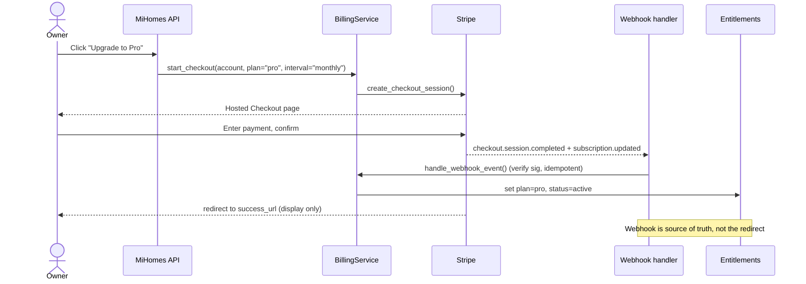

# Billing & Transactional Email Architecture

Specifies how MiHomes integrates subscription billing (Stripe) and transactional email (Resend) behind internal provider interfaces, so no business logic depends on a vendor SDK directly.

**Status: Draft — 2026-07-27**

---

## 1. Scope & principles

As MiHomes becomes a multi-tenant SaaS at **mihomes.ai** (Python 3.11+, FastAPI, SQLAlchemy, Postgres), two external service classes are introduced:

- **Payments = Stripe Billing** — subscriptions, free trials, metered/usage billing, invoices, webhooks, and the Stripe Customer Portal for self-serve plan changes and cancellation.
- **Transactional Email = Resend** (default provider) — authentication mail, receipts, invitations, password resets (future), notifications, and system emails.

**Hard requirement (verbatim from product):** *"Implement an internal Email Service abstraction to allow future migration or failover to Postmark or Amazon SES without changing application logic. All third-party services must be accessed through internal provider interfaces (`BillingProvider`, `EmailProvider`). No business logic may depend directly on vendor SDKs."*

This mirrors an **established codebase precedent**: the AI layer already uses a `Protocol` + factory over Claude/OpenAI/NIM/Ollama (`src/mihomes/services/ai/provider.py`), and the calendar gateway uses the same shape (`src/mihomes/services/gateways/calendar/provider.py`). `BillingProvider` and `EmailProvider` deliberately copy that pattern — a typed `Protocol`, a thin factory that selects the implementation by name, and a service layer that is the only thing business code touches.

### Phasing — Email lands before Billing

| Phase | Need | Provider work |
|-------|------|---------------|
| **Phase 0** | Waitlist confirmation emails | `EmailProvider` + `ResendProvider` |
| **Phase 2** | Staff invites / invite-accepted mail | `EmailService` email types expand |
| **Phase 3** | Billing, freemium, entitlements | `BillingProvider` + `StripeProvider` |

Email is a Phase 0 dependency; Billing is not required until Phase 3. Build and ship the Email abstraction first.

---

## 2. EmailProvider interface

### 2.1 Protocol

```python
# src/mihomes/services/email/provider.py
"""Email provider abstraction — Protocol, exceptions, factory."""

from __future__ import annotations

from dataclasses import dataclass
from typing import Protocol


class EmailProviderError(Exception):
    """Base exception for email provider errors."""


class EmailAuthError(EmailProviderError):
    """API key missing or invalid."""


class EmailSendError(EmailProviderError):
    """Provider rejected or failed to accept the message."""


@dataclass(frozen=True)
class EmailResult:
    provider_message_id: str
    provider: str  # "resend" | "postmark" | "ses" | "console"


class EmailProvider(Protocol):
    """Protocol for transactional email provider implementations.

    Deliberately narrow: a provider transports an already-rendered message.
    Template selection and rendering live in EmailService (§2.4–2.5) so they
    happen exactly once, identically, regardless of vendor — a provider that
    rendered its own (or vendor-hosted) templates would break failover.
    """

    def send(
        self,
        to: str | list[str],
        subject: str,
        html: str,
        *,
        text: str | None = None,
        reply_to: str | None = None,
    ) -> EmailResult:
        """Send a pre-rendered message. Returns the provider message id."""
        ...
```

### 2.2 ResendProvider (sketch)

```python
# src/mihomes/services/email/resend_provider.py
class ResendProvider:
    """EmailProvider backed by Resend."""

    def __init__(self, api_key: str, from_address: str):
        if not api_key:
            raise EmailAuthError("RESEND_API_KEY is not set")
        import resend
        resend.api_key = api_key
        self._resend = resend
        self._from = from_address   # e.g. "MiHomes <no-reply@send.mihomes.ai>", from EMAIL_FROM

    def send(self, to, subject, html, *, text=None, reply_to=None) -> EmailResult:
        try:
            resp = self._resend.Emails.send({
                "from": self._from,
                "to": to if isinstance(to, list) else [to],
                "subject": subject,
                "html": html,
                "text": text,
                "reply_to": reply_to,
            })
        except Exception as e:
            raise EmailSendError(str(e)) from e
        return EmailResult(provider_message_id=resp["id"], provider="resend")
```

A trivial `ConsoleProvider` (logs the rendered message, sends nothing) serves dev,
CI, and local CLI mode — no real key or network needed, same Protocol.

### 2.3 Factory (mirrors `ai/provider.get_provider`)

```python
def get_email_provider(provider_name: str = "resend", api_key: str | None = None,
                       from_address: str | None = None) -> EmailProvider:
    from_address = from_address or os.environ.get("EMAIL_FROM", "")
    if provider_name == "resend":
        from mihomes.services.email.resend_provider import ResendProvider
        return ResendProvider(api_key=api_key, from_address=from_address)
    elif provider_name == "postmark":
        from mihomes.services.email.postmark_provider import PostmarkProvider
        return PostmarkProvider(api_key=api_key, from_address=from_address)
    elif provider_name == "ses":
        from mihomes.services.email.ses_provider import SESProvider
        return SESProvider(from_address=from_address)
    elif provider_name == "console":
        from mihomes.services.email.console_provider import ConsoleProvider
        return ConsoleProvider()
    raise EmailProviderError(
        f"Unknown email provider: {provider_name}. Supported: resend, postmark, ses, console"
    )
```

### 2.4 EmailService — what business code calls

Business code (waitlist handler, invite service, billing webhook handler) **never imports Resend**. It calls `EmailService`, which owns the provider instance, template keys, rendering, logging, and retry — the provider only transports.

```python
# src/mihomes/services/email/service.py
class EmailService:
    def __init__(self, provider: EmailProvider):
        self._provider = provider

    def _send(self, to: str, template: str, data: dict) -> None:
        subject, html, text = render_template(template, data)  # §2.5, provider-agnostic
        self._provider.send(to, subject, html, text=text)

    def send_waitlist_confirmation(self, to: str, *, position: int) -> None:
        self._send(to, "waitlist_confirmation", {"position": position})

    def send_staff_invite(self, to: str, *, account_name: str, invite_url: str) -> None:
        self._send(to, "staff_invite", {"account_name": account_name, "invite_url": invite_url})
    # ... one method per email type below
```

Delivery semantics: email sends are at-least-once at best. Calls triggered from a
request or webhook handler must not block or fail the caller — catch
`EmailSendError`, log with the template key and recipient, and (for
invite/billing-critical mail) retry with backoff via a small outbox/queue. A lost
receipt email must never roll back a billing state change.

### 2.5 Template management — recommendation

**Recommendation: server-side templates (Jinja2, checked into the repo), not Resend-hosted templates.** Rationale:

- Templates stay version-controlled, reviewable in PRs, and portable across providers — a Resend-hosted template would not survive failover to Postmark/SES, breaking the abstraction requirement.
- `render_template(template, data) -> (subject, html, text)` lives in the email package; every provider consumes the same rendered output.
- Keep a shared base layout + per-type partials under `src/mihomes/services/email/templates/`.

### 2.6 Concrete email types

| Template key | Trigger | Phase |
|--------------|---------|-------|
| `waitlist_confirmation` | Waitlist signup | 0 |
| `welcome` | Account created / first login | 2 |
| `staff_invite` | Owner invites staff | 2 |
| `invite_accepted` | Invitee accepts | 2 |
| `receipt_invoice` | `invoice.paid` webhook | 3 |
| `trial_ending` | App-scheduled job for the no-card trial (§10); `customer.subscription.trial_will_end` webhook for card-first trials | 3 |
| `payment_failed` | `invoice.payment_failed` (dunning) | 3 |
| `subscription_cancelled` | `customer.subscription.deleted` | 3 |
| `weekly_ai_report` | Scheduled digest job — Estate only | **4** |
| `dunning_2`, `dunning_3`, `dunning_final` | The escalating retry ladder, scheduler-driven. Phase 3 sends the *first* `payment_failed`; the rungs after it are Phase 4 | **4** |
| drip sequence (`drip_*`) | Onboarding and re-engagement. Count, cadence and copy are an open product decision — `../specs/SPEC-005-phase4-polish-email-ga.md` **O1** | **4** |
| `deletion_requested`, `deletion_complete` | GDPR deletion state machine (transactional — never suppressed) | **4** |
| `export_ready` | Data export finished, download link (transactional) | **4** |

> **Phase 4 was previously absent from this table**, while `SAAS_PRD.md` §10 makes "full email
> lifecycle" the headline of that phase — so the catalogue read as complete and Phase 4 read as
> empty. Note also that the five templates `SAAS_PRD:191`'s GA gate names (welcome → invite →
> receipt → dunning → cancellation) all ship in Phases 2–3: the Phase 4 email work is the
> *lifecycle infrastructure* above, not those five.

### 2.7 Failover / migration story

Switching providers is a **config change, not a code change**: set `EMAIL_PROVIDER=postmark` and supply that provider's key. `EmailService` and all business code are untouched because they only know the `EmailProvider` Protocol. For active **failover**, a `FailoverEmailProvider` can wrap a primary + secondary and catch `EmailSendError` — still implementing the same Protocol, so callers never notice.

One honest caveat: failover is a config change *only if the standby's DNS is already
verified*. The secondary provider needs its own DKIM/SPF records on the sending
domain (or its own subdomain) published and verified **in advance** — domain
verification takes DNS propagation time, which you do not have during an outage.
Pre-verify `send.mihomes.ai` (or a sibling subdomain) with the standby at setup
time, not at failover time.

---

## 3. DNS & deliverability for mihomes.ai

Use a **dedicated sending subdomain** so transactional reputation is isolated from the root domain and from any future marketing sends.

- **Transactional (this doc): `send.mihomes.ai`** — verified in Resend.
- **Future marketing/bulk: `mail.mihomes.ai`** — a separate subdomain/provider so bulk complaints never poison transactional deliverability.

### Records to add (on `send.mihomes.ai`)

| Type | Purpose | Value |
|------|---------|-------|
| `TXT` (SPF) | Authorizes Resend's sending IPs for the subdomain | `v=spf1 include:<resend-provided> ~all` — exact include provided by Resend on domain verification |
| `CNAME` / `TXT` (DKIM) | Publishes the DKIM public key so Resend can cryptographically sign mail | Selector + key **provided by Resend on domain verification** |
| `MX` | Return-path / bounce handling for the sending subdomain | Provided by Resend |
| `TXT` (DMARC) on `_dmarc.mihomes.ai` | Tells receivers how to treat auth failures + where to send reports | `v=DMARC1; p=none; rua=mailto:dmarc@mihomes.ai` |

Notes:
- **Do not fabricate key values.** DKIM selector, SPF include, and MX host come from Resend at verification time.
- **DMARC rollout:** start `p=none` (monitor via aggregate reports), then tighten to `p=quarantine` and finally `p=reject` once SPF+DKIM alignment is confirmed clean.
- **Alignment mode:** keep the default **relaxed** alignment (do not set `adkim=s; aspf=s`) — the From domain is `send.mihomes.ai` while Resend's bounce/return-path typically sits on its own sub-label of the sending domain, and strict SPF alignment would fail that legitimately-signed mail. Relaxed alignment still requires the same organizational domain, which is the protection that matters here. Revisit strict `adkim` only after aggregate reports confirm the exact signing domains.
- **DMARC vs deliverability:** DMARC also protects the *root* domain from spoofing; since `mihomes.ai` itself sends no mail at launch, additionally publish `v=spf1 -all` and an empty DKIM policy posture for the apex once monitoring confirms nothing legitimate sends from it.
- **Warmup:** transactional volume is low and steady, so aggressive warmup is unnecessary; ramp naturally and watch bounce/complaint rates in the Resend dashboard before raising volume.

---

## 4. BillingProvider interface

### 4.1 Protocol

```python
# src/mihomes/services/billing/provider.py
from __future__ import annotations
from dataclasses import dataclass
from datetime import datetime
from typing import Protocol


class BillingProviderError(Exception): ...
class BillingAuthError(BillingProviderError): ...
class WebhookVerificationError(BillingProviderError): ...


@dataclass(frozen=True)
class SubscriptionState:
    """Vendor-neutral snapshot of a customer's subscription."""
    provider_subscription_id: str | None
    plan: str | None            # "free" | "pro" | "estate"
    status: str | None          # normalized status (see §5 mapping)
    current_period_end: datetime | None
    cancel_at_period_end: bool


@dataclass(frozen=True)
class NormalizedEvent:
    """Vendor-neutral billing event consumed by BillingService/entitlements.

    Deliberately carries *provider* identifiers, not a MiHomes account_id — a raw
    webhook only knows the provider's customer/subscription ids. Mapping
    provider_customer_id -> account is BillingService's job (via
    account.stripe_customer_id), never the provider adapter's: the adapter must
    stay stateless and DB-free.
    """
    type: str                   # "subscription.activated" | "subscription.updated" |
                                # "subscription.cancelled" | "subscription.trial_will_end" |
                                # "invoice.paid" | "invoice.payment_failed"
    provider_customer_id: str
    subscription: SubscriptionState | None
    raw_event_id: str           # provider event id, for idempotency
    occurred_at: datetime       # provider timestamp, for out-of-order handling (§6)


class BillingProvider(Protocol):
    def create_customer(self, *, account_id: str, email: str, name: str) -> str:
        """Create a billing customer (account_id stored as provider metadata for
        reconciliation); returns provider customer id."""
        ...

    def create_checkout_session(self, *, customer_id: str, plan: str, interval: str,
                                 success_url: str, cancel_url: str) -> str:
        """Start a subscription purchase for (plan, interval) — e.g. ("pro",
        "monthly"). Returns a hosted checkout URL. The plan→price-id mapping is
        provider-internal config (§9); a vendor price id must never appear in the
        interface or arrive from the client."""
        ...

    def get_subscription(self, *, customer_id: str) -> SubscriptionState:
        """Fetch current subscription state, normalized — used for reconciliation,
        never returns a raw vendor object."""
        ...

    def cancel(self, *, subscription_id: str, at_period_end: bool = True) -> None: ...

    def create_portal_session(self, *, customer_id: str, return_url: str) -> str:
        """Self-serve management; returns a hosted Customer Portal URL."""
        ...

    def handle_webhook_event(self, *, payload: bytes, signature: str) -> NormalizedEvent | None:
        """Verify signature and normalize a provider event. Returns None for event
        types we deliberately ignore (still ack them with 2xx); raises
        WebhookVerificationError on a bad signature."""
        ...
```

### 4.2 StripeProvider (sketch)

```python
# src/mihomes/services/billing/stripe_provider.py
class StripeProvider:
    def __init__(self, secret_key: str, webhook_secret: str):
        import stripe
        stripe.api_key = secret_key
        self._stripe = stripe
        self._webhook_secret = webhook_secret

    def create_checkout_session(self, *, customer_id, plan, interval, success_url, cancel_url) -> str:
        price_id = self._price_map[(plan, interval)]   # ("pro","monthly") -> Stripe price id
        s = self._stripe.checkout.Session.create(
            mode="subscription", customer=customer_id,
            line_items=[{"price": price_id, "quantity": 1}],
            success_url=success_url, cancel_url=cancel_url,
        )
        return s.url

    def handle_webhook_event(self, *, payload, signature) -> NormalizedEvent | None:
        try:
            event = self._stripe.Webhook.construct_event(payload, signature, self._webhook_secret)
        except self._stripe.error.SignatureVerificationError as e:
            raise WebhookVerificationError(str(e)) from e
        return _normalize(event)  # Stripe event -> NormalizedEvent; None if ignored type
```

The `_price_map` (plan+interval → Stripe price id) is loaded from config/env (§9);
it and the reverse map (price id → plan, used by `_normalize`) are the **only**
places Stripe price ids exist.

### 4.3 Factory + BillingService

```python
def get_billing_provider(provider_name: str = "stripe", **kw) -> BillingProvider:
    if provider_name == "stripe":
        from mihomes.services.billing.stripe_provider import StripeProvider
        return StripeProvider(**kw)
    raise BillingProviderError(f"Unknown billing provider: {provider_name}. Supported: stripe")
```

`BillingService` is the only thing app code and the entitlements service call. It maps `account` ↔ customer (looking up `account.stripe_customer_id` from `NormalizedEvent.provider_customer_id`), persists subscription state, applies `NormalizedEvent`s to entitlements, and triggers the matching `EmailService` message (receipt, dunning, cancellation). It never leaks a Stripe object to a caller, and the provider adapter never touches the database — the seam is: **adapter = vendor I/O + normalization; service = state + business rules**.

---

## 5. Stripe object model mapping

Plans are **Free / Pro / Estate**. Free carries **no Stripe subscription** (or a $0 "free" price); Pro/Estate are Stripe subscriptions offered **monthly + annual**. Pricing detail lives in [`../product/PRICING_AND_PACKAGING.md`](../product/PRICING_AND_PACKAGING.md) — not duplicated here.

| MiHomes concept | Stripe object |
|-----------------|---------------|
| `account` | `Customer` (store `stripe_customer_id` on the account) |
| Plan (Free/Pro/Estate) | `Product` |
| Billing cadence (monthly/annual) | `Price` (each plan has a monthly + annual price ID) |
| Subscription state on account | `Subscription.status` |

Persist on `account`: `stripe_customer_id`, `stripe_subscription_id`, `plan`, `subscription_status`, `current_period_end`.

### Status → entitlement behavior

| Stripe `status` | App behavior |
|-----------------|--------------|
| `trialing` | Full access (trial) |
| `active` | Full access |
| `past_due` | **Grace period** — full access, dunning emails sent |
| `unpaid` | Dunning exhausted — paid entitlements suspended per the over-limit policy in [`../product/PRICING_AND_PACKAGING.md`](../product/PRICING_AND_PACKAGING.md) §4.3: surplus homes/seats go **read-only**, the core home stays fully usable, nothing is deleted |
| `canceled` | **Downgrade to Free** entitlements (Stripe keeps status `active` until period end when `cancel_at_period_end` is set, so this fires at the right time). Over-limit surplus handled per §4.3 of the pricing doc |
| `incomplete` / `incomplete_expired` | Checkout never completed — treated as no active subscription → Free |
| `paused` | Treated as no active paid entitlements → Free-equivalent (only occurs if trial-without-payment-method pause is enabled; decide in §10) |
| *(no subscription row)* | Free — the default state of every account |

Normalization rule: the provider adapter maps this full vendor status set onto the
normalized statuses `trialing | active | past_due | unpaid | canceled | none`;
`incomplete`, `incomplete_expired`, and `paused` normalize to `none`. Any
**unknown** future vendor status normalizes to `none` (fail closed to Free
entitlements, never to paid access) and logs loudly.

The entitlements service (see [`../product/PRICING_AND_PACKAGING.md`](../product/PRICING_AND_PACKAGING.md)) consumes `subscription_status` + `plan` to gate features. **Webhooks are the source of truth** for these fields (Section 6).

---

## 6. Webhooks

Webhooks — not the browser redirect after checkout — are the **source of truth** for entitlement changes. Never flip an entitlement based on the client returning to `success_url`.

### Critical events

| Stripe event | Effect |
|--------------|--------|
| `checkout.session.completed` | Link customer/subscription to account; provisional activate |
| `customer.subscription.created` / `customer.subscription.updated` | Update plan + status (activation/upgrade/downgrade/past_due) |
| `customer.subscription.trial_will_end` | Send `trial_ending` email (~3 days before trial end) |
| `customer.subscription.deleted` | Downgrade to Free; send cancellation email |
| `invoice.paid` | Confirm active; send receipt/invoice email |
| `invoice.payment_failed` | Enter dunning; send payment-failed email |

All other event types are acked (2xx) and ignored (`handle_webhook_event` returns `None`).

### Security & reliability

- **Signature verification:** every webhook request is verified with `STRIPE_WEBHOOK_SECRET` via `Webhook.construct_event` **on the raw request bytes** (read the body before any JSON parsing — a re-serialized body fails verification); unverified requests are rejected (`WebhookVerificationError` → HTTP 400). Replay protection: the signed payload includes a timestamp and `construct_event` enforces a tolerance window (default 5 minutes), so an attacker replaying a captured payload later fails verification. Within-window replays are absorbed by idempotency (below).
- **Idempotency:** store each processed `event.id` in a `processed_webhook_events` table (with a unique constraint, so two concurrent deliveries of the same event race safely); if seen, ack and no-op. Stripe retries on non-2xx, so handlers must be safe to run twice.
- **Out-of-order delivery:** Stripe does **not** guarantee event ordering. Never apply an older state over a newer one — compare the event's `occurred_at` (or the subscription's version) against the last-applied timestamp stored on the account, and skip stale events. Alternatively (simpler and robust): treat any subscription event as a *trigger* and re-fetch authoritative state via `get_subscription()` before persisting.
- **Fast ack:** verify + persist the raw event, return 2xx quickly, then process. Long work (emails) should not block the ack. If processing is deferred, failures after the 2xx must land in a retry queue or the reconciliation sweep below — Stripe will not redeliver an acked event.
- **Reconciliation (webhooks fail eventually):** a daily job iterates accounts with a `stripe_customer_id` and diffs `get_subscription()` against local state, repairing drift and alerting. This is the backstop for missed/dropped webhooks, bugs in `_normalize`, and manual changes made in the Stripe dashboard.
- **Endpoint hygiene:** the webhook route is unauthenticated by design (signature is the auth) — exclude it from session auth *and* from tenant scoping middleware; it resolves the account itself via `provider_customer_id`. Rotating `STRIPE_WEBHOOK_SECRET` requires supporting two secrets during the overlap window.

---

## 7. Checkout & Customer Portal flows

- **Free → Pro upgrade:** owner clicks *Upgrade* → backend calls `BillingService.start_checkout(account, plan="pro", interval="monthly")` (plan/interval validated server-side against the catalog — the client never supplies a price id) → `StripeProvider.create_checkout_session` → redirect to Stripe-hosted Checkout → on payment, Stripe fires `checkout.session.completed` + `customer.subscription.created`/`updated` → webhook handler flips entitlements → owner returns to `success_url` (which only shows a confirmation; it does **not** grant access — it may poll the account's entitlement state while the webhook lands).
- **Self-serve management:** `create_portal_session` returns a **Stripe Customer Portal** URL for plan changes, payment-method updates, and cancellation — no custom billing UI to build/maintain.
- **Roles:** only the **owner** (who holds billing) may start checkout or open the portal; staff roles are forbidden at the service layer.



---

## 8. Metered AI usage (future)

MiHomes AI features are a natural fit for **Stripe metered billing** once overage pricing is introduced. Forward-looking design:

- Add a metered `Price` per plan for AI units beyond the included allowance.
- `BillingService.report_usage(account_id, quantity)` wraps Stripe usage reporting (the current **Billing Meters** API — meter events — not the legacy per-subscription-item usage records, which Stripe has deprecated); the AI layer emits usage events, billing translates them — the AI code never touches Stripe.
- Aggregate locally and report periodically (idempotent, deduped) rather than per-call, to survive retries and avoid double-billing. The local aggregate is also what the in-app usage meter and plan limits read (see the pricing doc §5) — Stripe is only the *billing* consumer of usage, never the source of truth for limits.

Not built in Phase 3; captured so the `BillingProvider` interface can grow a `report_usage` method without disrupting callers.

---

## 9. Secrets & config

All keys come from environment variables, **never** hardcoded. Test-mode keys for dev/CI, live-mode for production; the provider factories are agnostic to which.

| Env var | Used by |
|---------|---------|
| `RESEND_API_KEY` | `ResendProvider` |
| `EMAIL_PROVIDER` | Email factory (default `resend`; `console` in dev/CI) |
| `EMAIL_FROM` | Default From address (`no-reply@send.mihomes.ai`) |
| `STRIPE_SECRET_KEY` | `StripeProvider` |
| `STRIPE_WEBHOOK_SECRET` | Webhook signature verification (support two during rotation, §6) |
| `STRIPE_PRICE_PRO_MONTHLY` / `_PRO_ANNUAL` / `_ESTATE_MONTHLY` / `_ESTATE_ANNUAL` | `StripeProvider._price_map` — price ids differ between test and live mode, so they are config, not code |
| `BILLING_PROVIDER` | Billing factory (default `stripe`) |

The repo already gitignores secrets — `.env`, `.env.*`, `*.pem`, `*_token.json`, `*secret*.json` — so local keys never reach version control. In production, secrets come from the host's secret manager, are never logged, and `STRIPE_SECRET_KEY` must be a **restricted key** scoped to the operations the provider actually performs, not the account-wide default key.

---

## 10. Open questions / risks

- **Tax:** enable **Stripe Tax** for automatic VAT/sales-tax calculation, or adopt a **merchant-of-record** (e.g. Paddle) to offload tax liability entirely? MoR would change the `BillingProvider` implementation but not the interface.
- **SCA / 3DS:** European cardholders require Strong Customer Authentication; Stripe Checkout + Portal handle this natively — a reason to prefer hosted flows over a custom form.
- **Dunning policy:** how many retries / how long in `past_due` grace before moving to `unpaid` (read-only)? Configure Stripe Smart Retries + the dunning email cadence.
- **Proration:** on mid-cycle plan change (Pro ↔ Estate, monthly ↔ annual), prorate immediately or at period end? Default to Stripe proration; confirm with product.
- **Refunds:** define policy and whether refunds are issued via the Stripe dashboard (manual) or exposed in-app.
- **Free plan modeling:** decide between "no subscription" vs a "$0 price" for Free — the latter keeps every account a Stripe customer with a subscription object, simplifying status handling at the cost of extra Stripe objects. Recommendation: **no subscription** — the §5 mapping already treats "no subscription row" as Free, and creating Stripe customers lazily (at first checkout) avoids minting objects for every free signup.
- **No-card trial is app-managed, not Stripe-managed:** the pricing doc (§4.2) locks a **14-day Pro trial without a credit card**, which can start before any Stripe customer or subscription exists. Stripe's `trialing` status therefore only appears for card-first flows; the no-card trial needs app-side state (`trial_ends_at` on the account) feeding the entitlements service, plus an app-scheduled `trial_ending` email. Stripe's `customer.subscription.trial_will_end` webhook covers only the card-first variant. Reconcile the two paths explicitly in Phase 3 design.
