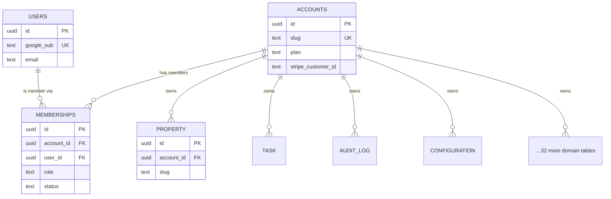

# MiHomes Multitenancy Architecture

Purpose: define how MiHomes converts from a single-user local app into a shared-Postgres, per-account multi-tenant SaaS.
Status: Draft — 2026-07-27

---

## 1. Current state (honest baseline)

MiHomes today is **local-first and single-user**. There is no concept of a user,
account, or tenant anywhere in the codebase. The facts, verified against the code:

- **Storage:** one global SQLite database, WAL mode, opened through a single engine
  singleton. See `src/mihomes/db.py`:
  - `get_engine()` lazily builds one process-wide `Engine`.
  - `get_session()` is a context manager yielding an **unscoped** `Session` that
    commits/rolls back/closes. No filter, no tenant, no auth.
  - A `PRAGMA journal_mode=WAL` / `foreign_keys=ON` / `busy_timeout` hook fires on
    every SQLite connect.
- **ORM:** SQLAlchemy 2.0 (`Mapped[...]` / `mapped_column`), Alembic for schema —
  currently **36 revision files** under `alembic/versions/` (grows over time).
- **Domain:** 28 model modules under `src/mihomes/models/` (property, space, task,
  issue, staff, vendor, asset, work_order, contract, consumable, budget,
  recurring_expense, document, note, event, appointment, ai_conversation, alert,
  audit_log, tag, template, zone, book, insurance, staff_pto, vendor_rating,
  ha_entity, configuration), together defining **36 tables** — several modules
  declare child tables (`task_schedules`, `transactions`, `asset_price_entries`,
  `consumable_price_entries`, `guests`, `event_guests`, `template_items`,
  `tag_assignments`). Every one is a subclass of a shared `Base` and every row lives
  in the same physical database.
- **Surfaces:** Typer CLI (`mihomes <entity> <action>`) and a FastAPI + htmx web app
  (23 route modules, 140+ endpoints, under `src/mihomes/web/`). Both call
  `get_session()` directly.

**Why this is a re-platform, not a bolt-on.** Multitenancy is not a feature you add
to a query here and there — it is a global invariant: *every* row of *every*
tenant-owned table must be attributable to exactly one account, and *every* read and
write must be provably scoped to the caller's account. That invariant touches the
engine, the session lifecycle, all 36 tables, all migrations, and both surfaces. It
also requires a database that can enforce isolation at the row level (Postgres RLS),
which SQLite cannot. Treat this as a deliberate migration, sequenced by the phases in
[the product phasing](#8-phasing-recap).

---

## 2. Tenancy model (CANON)

**Shared PostgreSQL, one database, one schema, `account_id` on every tenant-owned
table.** Every query is scoped by the current account. Postgres **Row-Level Security
(RLS)** is a defense-in-depth backstop — it catches a forgotten application filter;
it is *not* the primary mechanism. Application-level scoping is primary.

Rejected alternatives (for the record): database-per-tenant (every tenant database
migrated in lockstep, connection-pool explosion, ops burden) and schema-per-tenant
(migration fan-out, `search_path` juggling). A shared table with `account_id` is the
right fit for many small households/estates.

---

## 3. Target data model

### 3.1 New core identity tables

```
accounts            one row per household / estate (the tenant)
users               one row per human, GLOBAL (not tenant-owned)
memberships         join: user ↔ account, carries the role
```

**`accounts`** — the tenant boundary.

| column               | type          | notes                                             |
|----------------------|---------------|---------------------------------------------------|
| id                   | uuid PK       | tenant key; referenced by every scoped table      |
| slug                 | text unique   | consistent with existing slug convention          |
| name                 | text not null | display name of the household/estate              |
| type                 | text not null | `household` \| `estate` — referenced by `ONBOARDING_AUTH_RBAC.md` §3 |
| plan                 | text not null | `free` \| `pro` \| `estate` (see pricing doc)     |
| stripe_customer_id   | text null     | Stripe Billing customer; billing state lives here |
| stripe_subscription_id | text null   | active provider subscription, if any              |
| subscription_status  | text null     | mirror of Stripe subscription state               |
| current_period_end   | timestamptz null | end of the paid period (from webhooks)         |
| trial_ends_at        | timestamptz null | app-managed no-card trial; there is **no** Stripe subscription during it (`PRICING` §4.2) |
| trial_used_at        | timestamptz null | one trial per account, ever — set on first use  |
| created_at           | timestamptz   |                                                   |
| updated_at           | timestamptz   |                                                   |

(`stripe_customer_id` is set once at customer creation; the subscription-state
columns — `plan`, `stripe_subscription_id`, `subscription_status`,
`current_period_end` — are written **only** by the billing webhook handler — see
[`BILLING_AND_EMAIL.md`](BILLING_AND_EMAIL.md) §5–6; webhooks are the source of
truth for entitlement state.)

**`users`** — a person. **Global**, one row per human, keyed off Google `sub`.

| column        | type        | notes                                          |
|---------------|-------------|------------------------------------------------|
| id            | uuid PK     |                                                |
| google_sub    | text unique | OIDC subject; the stable identity key          |
| email         | text        | from Google claims; may change, not the key    |
| name          | text null   |                                                |
| avatar_url    | text null   |                                                |
| created_at    | timestamptz |                                                |
| last_login_at | timestamptz |                                                |

**`memberships`** — user↔account with a role. A user may belong to many accounts.

| column     | type        | notes                                              |
|------------|-------------|----------------------------------------------------|
| id         | uuid PK     |                                                    |
| account_id | uuid FK     | → accounts.id                                      |
| user_id    | uuid FK     | → users.id                                         |
| role       | text        | `owner` \| `admin` \| `staff`                      |
| status     | text        | `active` \| `revoked`                              |
| invited_by | uuid null   | → users.id (who created the membership)            |
| created_at | timestamptz |                                                    |

A membership always references a real `users` row, so it is created **only at invite
acceptance** — a pending invitee may not have a `users` row yet. Pending invitations
therefore live in a separate `invites` table (see [`../product/ONBOARDING_AUTH_RBAC.md`](../product/ONBOARDING_AUTH_RBAC.md) §6),
**not** as an `invited` membership status. This is why `status` has no `invited` value.

Constraints: `UNIQUE (account_id, user_id)`; a **partial unique index** enforcing
exactly one `role = 'owner'` per account (`WHERE role = 'owner' AND status = 'active'`).

**Roles** (CANON): `owner` = billing + full control, one per account, transferable.
`admin` = full operational control, no billing. `staff` = scoped operational access
for invited external help (housekeeper, property manager). RBAC *enforcement* is
Phase 2; this doc only fixes the shape.

### 3.2 The `account_id` rule

**Every one of the 36 existing tables becomes tenant-owned and gains a non-null
`account_id uuid` FK → `accounts.id`, indexed.** This includes child tables
(`task_schedules`, `transactions`, `tag_assignments`, …): `account_id` is
**denormalized onto every table**, not just aggregate roots, because RLS policies are
per-table and cannot cheaply join to a parent. Add a composite FK or trigger check
that a child's `account_id` matches its parent's, so denormalization cannot drift.
Composite indexes lead with `account_id` (e.g. `(account_id, status)`,
`(account_id, slug)`), and slug uniqueness becomes **per-account**:
`UNIQUE (account_id, slug)` rather than global.

### 3.3 Tenant-owned vs. global

| table                     | ownership   | rationale                                                        |
|---------------------------|-------------|------------------------------------------------------------------|
| the 36 domain tables      | per-account | all business data; each gets `account_id` not-null               |
| `users`                   | **global**  | a person exists independent of any account; keyed on Google sub  |
| `accounts`, `memberships` | identity    | define the boundary itself; `memberships` carries `account_id`   |
| `audit_log`               | per-account | security records must be tenant-attributed and tenant-visible    |
| `configuration`           | **per-account** | see below                                                     |
| `invites`                 | per-account | pending invitations; an invitee has no `users` row yet          |
| `membership_property_scopes` | per-account | `(membership_id, property_id)`; staff scoping whitelist       |
| `sessions`                | **global, no RLS** | read before the account is known — a tenant policy breaks login |
| `processed_webhook_events` | **global, no RLS** | a provider event arrives before it maps to an account; a policy makes every webhook reprocess |
| `waitlist`                | **global**  | Phase 0 signup funnel; predates any account                      |

**`configuration` decision — per-account.** Today `configurations` is a global
key/value table (`key` PK, `value`). Its contents are tenant preferences (units,
locale, feature toggles for that household), so it must be scoped: the primary key
becomes composite **`(account_id, key)`** and it gains an `account_id` FK. Any truly
system-wide/deployment setting (not currently present) would live in an environment
variable or a separate `system_settings` table, never in per-account rows — do not
overload one table with both.

### 3.4 ER sketch



---

## 4. Tenant scoping strategy

Every query must be filtered by `account_id`. Two layers, application-primary:

### 4.1 Layer 1 — application scoping (primary)

A **request-scoped "current account" context** carries the resolved `account_id` for
the duration of a request, plus a session that auto-applies the filter.

1. **Resolve tenant per request.** Auth middleware turns the Google OIDC session into
   `current_user`, then resolves the active `account_id` (from the URL/account picker)
   and asserts an `active` membership exists. Store both in a `ContextVar`.
2. **Scoped session.** A `TenantSession` (or a `with_loader_criteria` global filter)
   injects `WHERE account_id = :current_account` into every query against a
   tenant-owned model, and stamps `account_id` on every insert.

```python
# sketch — request-scoped tenant context + auto-filter
current_account: ContextVar[UUID] = ContextVar("current_account")

class TenantOwned:                         # mixin on all 36 tenant-owned models
    account_id: Mapped[UUID] = mapped_column(
        ForeignKey("accounts.id"), nullable=False, index=True
    )

@event.listens_for(Session, "do_orm_execute")
def _apply_tenant_filter(state):
    # NOT just is_select: with_loader_criteria also applies to ORM-enabled
    # UPDATE/DELETE. Guarding on is_select alone would leave bulk
    # update()/delete() statements unscoped — a cross-tenant write path.
    if (
        (state.is_select or state.is_update or state.is_delete)
        and not state.execution_options.get("skip_tenant")
    ):
        state.statement = state.statement.options(
            with_loader_criteria(
                TenantOwned,
                lambda cls: cls.account_id == current_account.get(),
                include_aliases=True,
            )
        )

@event.listens_for(Session, "before_flush")
def _stamp_tenant_on_insert(session, flush_context, instances):
    for obj in session.new:
        if isinstance(obj, TenantOwned) and obj.account_id is None:
            obj.account_id = current_account.get()   # raises if unset — fail closed
```

Notes on the sketch:

- `current_account.get()` with no default **raises `LookupError`** when the context
  is unset — that is the fail-closed behavior we want (an unauthenticated or
  misconfigured code path cannot run an unscoped query).
- Any use of `skip_tenant` (admin/ops tooling only) must be grepable and
  code-reviewed; it is the equivalent of `sudo`.
- `with_loader_criteria` covers lazy loads, `selectinload`, and joined eagerloads,
  but **not raw Core `text()` queries** — those rely entirely on RLS (§4.2).

### 4.2 Layer 2 — Postgres RLS (backstop)

Enable RLS on every tenant-owned table so the database refuses cross-tenant rows even
if the application forgets a filter:

```sql
ALTER TABLE properties ENABLE ROW LEVEL SECURITY;
ALTER TABLE properties FORCE ROW LEVEL SECURITY;
CREATE POLICY tenant_isolation ON properties
  USING     (account_id = current_setting('app.current_account', true)::uuid)
  WITH CHECK (account_id = current_setting('app.current_account', true)::uuid);
```

The second argument to `current_setting(..., true)` (`missing_ok`) matters: without
it, an unset GUC makes every query **error**; with it, an unset GUC yields `NULL`,
the predicate is never true, and the query returns **zero rows** — fail closed
either way, but zero-rows is the predictable behavior §9 relies on.

Each request sets the GUC transaction-scoped. Note: `SET LOCAL x = :param` does
**not** accept bind parameters in Postgres — use `set_config()`, which is an
ordinary function call and does:

```python
@contextmanager
def get_session(account_id: UUID):
    session = SessionLocal()
    # set_config(..., is_local=true) == SET LOCAL: auto-reset at tx end
    session.execute(
        text("SELECT set_config('app.current_account', :aid, true)"),
        {"aid": str(account_id)},
    )
    ...
```

Because `set_config(..., true)` is transaction-local, it must be re-issued **after
every commit/rollback** if the same session runs multiple transactions in one
request. Hook it on the session's `after_begin` event rather than calling it once at
session open, so a second transaction can never silently run with the GUC unset
(which would return zero rows and look like missing data, or worse, mask a bug).

**The forgotten-filter risk.** The realistic failure is a hand-written query, a raw
`session.execute(text(...))`, or a new model that misses the mixin — any of which
would otherwise read across tenants. RLS is the safety net: even a completely
unscoped `SELECT * FROM properties` returns only the current account's rows, because
the `USING` clause is enforced by Postgres, not by our code. Application scoping keeps
queries efficient and correct; RLS makes a mistake fail closed instead of leaking.

> The app's DB role must **not** be `BYPASSRLS` and must not be the table owner
> (owners bypass RLS unless `FORCE ROW LEVEL SECURITY` is set). Use a dedicated
> non-owner `app` role and `ALTER TABLE ... FORCE ROW LEVEL SECURITY`. Alembic
> migrations run as the owner/migration role, which bypasses these policies — that
> is correct and intended; only the runtime `app` role is constrained.

**Bootstrap exception — `users` and `memberships`.** `users` is global (no
`account_id`), so it carries no tenant RLS. `memberships` *does* carry
`account_id`, but the **account-picker query** ("which accounts does this user
belong to?") must run *before* any account context exists — an
`app.current_account`-keyed policy would return zero rows and lock every user out.
`memberships` therefore needs a second policy keyed on the authenticated user
(e.g. `USING (user_id = current_setting('app.current_user', true)::uuid)`), OR'd
with the tenant policy, with `app.current_user` set by auth middleware the same way
as `app.current_account`. This is the only table with a user-keyed policy; keep it
that way.

---

## 5. SQLite → Postgres migration

### 5.1 Engine change

- Replace the SQLite URL with a Postgres URL (`postgresql+psycopg://…`); drop the
  SQLite `PRAGMA` connect hook (WAL/`foreign_keys` are SQLite-only). Postgres
  enforces FKs natively.
- Move connection pooling to a real pool (see §7). The `_active_url()` /
  `MIHOMES_DEMO` switch stays only for the local CLI mode (§6).

### 5.2 Alembic history — squash, don't drag

Recommendation: **squash the 36 existing revisions into a single baseline** targeting
Postgres, rather than replaying a SQLite-shaped history against a new engine. The
current migrations contain SQLite-isms (batch-mode `ALTER`, `PRAGMA`, SQLite type
affinities) that are noise on Postgres and a replay risk. Because there are no hosted
tenants yet, there is no production history to preserve. Steps:

1. Cut a new baseline migration `0001_pg_baseline` that creates the identity tables
   (`accounts`, `users`, `memberships` + constraints), all 36 domain tables, **and the
   five tables below that are neither** — with Postgres-native types (see §5.4) and
   non-null `account_id` columns, slug uniqueness as `(account_id, slug)`, and the
   `configurations` PK as `(account_id, key)`. Since there is no hosted data yet, there
   is nothing to backfill — the nullable→backfill→NOT NULL dance (§10.8) applies only to
   future changes against live tenant data, not to this baseline.

   **The five easily-missed tables.** They are not domain tables and not identity tables,
   so a list of "identity + the 36" silently omits every one:

   | table | tenancy | note |
   |---|---|---|
   | `invites` | per-account | pending invitations; a seat counts against the plan (`PRICING` §3.2) |
   | `membership_property_scopes` | per-account | `(membership_id, property_id)` — staff scoping |
   | `sessions` | **global, no RLS** | read *before* an account is known, so a tenant policy makes every login fail |
   | `processed_webhook_events` | **global, no RLS** | same reason: a Stripe event arrives before it maps to an account. A policy here makes every webhook silently reprocess |
   | `waitlist` | **global** | created in Phase 0, **must not be dropped** by this baseline — `confirmed_at` is the funnel's only record |

   **The two `no RLS` rows are deliberate carve-outs, not oversights.** Anyone adding a
   blanket "every table gets a tenant policy" migration later will break login and webhook
   processing at the same time, and both fail quietly.

   §3.1 and this list must name the **same** set. `../PRD_REVIEW.md` §A5 flags this as the
   gap that regrows: it was already wrong once, and the fix is to re-run the comparison as
   a standing check rather than to trust either list.
2. `0002_rls` — RLS policies + `FORCE ROW LEVEL SECURITY` per tenant table, and the
   non-owner `app` role grants.
3. Archive the old `alembic/versions/*` under a `legacy_sqlite/` folder for reference;
   they no longer run.

**The catch: the local SQLite mode (§6) still needs migrations.** Two options —
(a) keep the legacy SQLite chain alive for local mode and maintain two Alembic
branches (drift risk, double maintenance), or (b) make the squashed baseline
dialect-aware (skip RLS/`jsonb`/`timestamptz` specifics on SQLite) so one chain
serves both engines. Recommendation: **(b)** — one history, small
`if bind.dialect.name == "postgresql"` guards in the two Postgres-only migrations.
Existing local installs upgrade by stamping the new baseline after a verified
schema-equivalence check, or by export/import through the §5.3 path.

### 5.3 Data migration for existing local installs

Each existing local SQLite database becomes **exactly one account** (see §6). A
one-shot importer:

1. Create one `accounts` row + the owner `users`/`memberships` rows.
2. Stream each SQLite table into Postgres **in FK dependency order** (parents before
   children), stamping the new `account_id` on every row.
3. Remap integer autoincrement PKs per the PK decision in §10.1 — if UUIDs win,
   build an old-id→uuid map per table during import and rewrite every FK column
   through it; decide once and apply uniformly.
4. Validate after import: per-table row counts match the source, FK integrity checks
   pass, and a spot-check of slugs/dates round-trips correctly (SQLite stores
   datetimes as text — parse as UTC, §5.4). Run the importer inside one transaction
   so a failed import leaves nothing behind.

### 5.4 SQLite-isms to fix

| SQLite behavior                     | Postgres target                                     |
|-------------------------------------|-----------------------------------------------------|
| `PRAGMA journal_mode/foreign_keys`  | drop; native FKs, `SET LOCAL` GUCs instead          |
| `INTEGER PRIMARY KEY` autoincrement | `uuid` PK (`gen_random_uuid()`) or `bigint identity`|
| `Boolean` stored as 0/1             | native `boolean`                                    |
| dynamic type affinity / `Text` JSON | native `jsonb` for JSON columns                     |
| datetimes as text                   | `timestamptz` (store UTC)                            |
| case-insensitive `LIKE` quirks      | use `ILIKE` / `citext` where matching mattered      |
| batch `ALTER TABLE` (Alembic)       | plain `ALTER TABLE` (Postgres supports it directly) |

---

## 6. The CLI after the re-platform — an operator tool, not a second mode

> **Rewritten 2026-08-05.** This section previously specified a "one local install = one
> account" bridge in which SQLite and Postgres coexisted as two supported deployment modes.
> **That bridge was dropped** — `../specs/SPEC-002-phase1-multitenant-foundation.md` **D1**.
> The reasoning is recorded because the dual-mode design touched a lot of this document.

**There is one storage backend: hosted Postgres.** Local SQLite mode is not a supported
deployment. What survives is the CLI, re-pointed:

| surface | storage | tenant resolution | auth |
|---|---|---|---|
| **Web app** (customers) | shared Postgres + RLS | per-request from the OIDC session | Google OIDC |
| **CLI** (operator) | the *same* hosted Postgres | explicit `--account`, never implicit | operator credentials |

Why the dual-mode bridge did not survive contact:

- **It doubled the load-bearing layer.** A SQLite branch means a dialect fork in `db.py`, a
  dialect-aware Alembic chain, and a local-mode entitlements bypass — all in the tenant-scoping
  code that isolation depends on. The cheapest way to be confident about that layer is for it
  to have one shape.
- **RLS does not exist on SQLite.** Local mode had no database backstop by construction. That
  is defensible with one tenant and indefensible as a *supported configuration* whose code path
  is shared with the hosted one.
- **It described a user who no longer exists.** The bridge existed for the founder's own
  install. `SPEC-002` **D10** handles that case directly instead: the first hosted tenant is a
  clean signup, and the existing archive imports later via `mihomes import` (§5.3), decoupled
  from launch.

**What this means for the CLI.** It keeps working, against hosted Postgres, as an admin client:
inspection, imports, scheduled jobs, and support tasks. Two consequences worth stating, because
they are easy to get wrong:

- **The account must be explicit.** There is no pinned single-account constant to fall back on.
  A CLI command that operates on tenant data takes the account as an argument and fails without
  it — an implicit default is the same cross-tenant hazard as an unlinked chat sender.
- **It is not a customer interface.** Nothing in the product's value proposition should require
  it, and no customer-facing feature may be CLI-only.

Migrating any *future* self-hosted user in remains the §5.3 importer path, unchanged.

---

## 7. Session / connection architecture

Move from the global engine + unscoped `get_session()` (today's shape in
`src/mihomes/db.py`) to a **per-request session that knows its tenant**:

1. **Engine/pool.** Keep a process-wide engine, but back it with a real connection
   pool (`pool_size`, `max_overflow`, `pool_pre_ping=True`). The engine is shared; the
   *tenant* is per session, never baked into the engine.
2. **Request lifecycle (SaaS):** middleware resolves `current_user` → active
   `account_id` → sets the `ContextVar` → opens a session → issues
   `set_config('app.current_account', :id, true)` at the start of each transaction
   (§4.2 `after_begin` hook) → hands the scoped session to routes →
   commit/rollback/close, which ends the transaction and **auto-resets** the GUC.
3. **`get_session()` gains a tenant parameter** (or reads the `ContextVar`) and both
   the CLI and web surfaces call the tenant-aware version.

**Pooled-connection leak — the sharp edge.** Connections are reused across requests.
A plain `SET app.current_account = X` **persists on the physical connection** and, if
the next request reuses it without re-setting, that request would run under the
previous tenant's GUC. Two defenses, use both:

- Prefer **transaction-local** setting (`set_config(..., true)`, §4.2) inside the
  request transaction — it is cleared automatically on commit/rollback, including
  SQLAlchemy's implicit rollback when a connection is returned to the pool. Never
  use a bare session-level `SET`.
- Belt-and-braces: a **pool `checkin`/`reset` event** that issues
  `RESET app.current_account` (`DISCARD ALL` also works but drops prepared
  statements and is heavier), so even a code path that mistakenly used session-level
  `SET` cannot carry tenant state to the next checkout. This hook is cheap and makes
  the invariant hold independent of application discipline.
- Combined with `current_setting(..., missing_ok)` semantics (§4.2), a connection
  with a reset GUC yields **zero rows** under RLS, not another tenant's rows — the
  failure mode of a missed re-set is visible breakage, not silent leakage.

**PgBouncer caveat:** if a transaction-pooling proxy (PgBouncer/pgcat in
`transaction` mode) is ever introduced, session-level `SET` becomes actively
dangerous (the server connection is multiplexed across clients between
transactions) and even the checkin hook runs against the *proxy*, not the server
connection. Transaction-local `set_config(..., true)` issued inside each
transaction remains correct under transaction pooling — one more reason it is the
primary mechanism.

---

## 8. Phasing recap

- **Phase 0** — landing + waitlist + Google sign-in (validate demand).
- **Phase 1** — *this doc's core*: Postgres, `accounts`/`users`/`memberships`, tenant
  scoping, auth, RLS.
- **Phase 2** — onboarding + staff invites + roles/RBAC enforcement + the **entitlements
  service in config-only form** (it exists and is called; every account is Free).
- **Phase 3** — billing/freemium (Stripe); billing status wired **into** the entitlements
  service as an input, plus the plan gates that actually deny.
- **Phase 4** — polish, email lifecycle (Resend), GA launch on **mihomes.ai**.

Entitlement/limit enforcement (Free = 1 home + 3 seats; Pro/Estate expand) is checked
in a central **entitlements service** at the seam where tenancy meets billing — e.g.
membership creation checks the seat limit, property creation checks the home limit,
both reading `account.plan` **and** `account.subscription_status` (a `past_due` or
`canceled` Pro account is not entitled to Pro limits — see the status→behavior table
in [`BILLING_AND_EMAIL.md`](BILLING_AND_EMAIL.md) §5). The price table itself lives in
[`../product/PRICING_AND_PACKAGING.md`](../product/PRICING_AND_PACKAGING.md); do not
duplicate it here. Billing/email specifics (`BillingProvider`, `EmailProvider`,
`account.stripe_customer_id`, subscription state) are out of scope for this doc.

---

## 9. Security & isolation

Cross-tenant data leakage is the **#1 risk** of this entire re-platform. Controls:

- **Defense in depth:** application scoping (§4.1) + Postgres RLS (§4.2). Neither is
  trusted alone.
- **Isolation test (mandatory, CI-gated):** seed accounts A and B; for **every**
  tenant-owned model, assert that a session bound to A can never read, update, or
  delete B's rows — via ORM queries, ORM bulk `update()`/`delete()`, *and* raw
  `session.execute(text(...))` — and can never **insert** a row stamped with B's
  `account_id` (the RLS `WITH CHECK` clause must reject it). Run this test against
  Postgres with RLS enabled, not SQLite — the raw-SQL cases are only defended by
  RLS. Derive the model list from the `TenantOwned` mixin registry so a new model is
  covered automatically. This test is the executable definition of the tenancy
  invariant; it must run on every PR.
- **Membership revocation is immediate:** tenant resolution (§4.1) checks for an
  `active` membership on **every request**, so revoking a membership cuts access on
  the next request — no long-lived per-account token to invalidate.
- **Fail-closed default:** if `current_account` is unset, the scoped session raises
  rather than running unscoped. RLS with an unset GUC returns zero rows, not all rows.
- **Non-privileged DB role:** the app connects as a non-owner role without
  `BYPASSRLS`; tables use `FORCE ROW LEVEL SECURITY`.
- **Connection hygiene:** transaction-local `set_config` + pool `RESET` (§7) so
  tenant state never leaks across pooled requests.
- **Audit:** `audit_log` is per-account; membership/role changes and account switches
  are logged.
- **Global-table discipline:** at launch, `users` is the only cross-account business
  table, and writes to it are limited to auth/identity flows, never general request
  handlers. Additional global tables are introduced only by deliberate design — e.g.
  the Vendor Discovery growth bet adds `GlobalVendor`, its research snapshots, and a
  global moderation audit (see [`../product/VENDOR_DISCOVERY_PRD.md`](../product/VENDOR_DISCOVERY_PRD.md)).
  Any new global table must be justified here, carry no `account_id`, and gate its
  writes behind a dedicated privileged path rather than tenant request handlers.

---

## 10. Open questions / risks

1. ~~**PK strategy:** UUID everywhere vs. keep integer PKs + `account_id`.~~
   **RESOLVED — UUIDv7 everywhere, generated app-side, no DB-side default.** v7 keeps the
   time-ordered index locality that plain v4 destroys; `gen_random_uuid()` emits v4, which
   is why the default is app-side via a `mihomes.ids.new_id()` helper rather than in the
   DDL (`uuid.uuid7()` is stdlib only from Python 3.14, against a `>=3.11` floor).
   See `../specs/SPEC-001-phase0-landing-waitlist.md` §4.1.
2. **Global filter mechanism:** `with_loader_criteria` event hook vs. a bespoke
   `TenantSession` subclass — validate that the event approach covers relationship
   loads, `selectinload`, and bulk operations without gaps.
3. **Raw SQL surface:** audit every existing `session.execute(text(...))` — these
   bypass the ORM filter and rely entirely on RLS. Known call sites today:
   `src/mihomes/services/archive.py`, `src/mihomes/services/backup.py`,
   `src/mihomes/services/ai/tools.py` (the AI tool layer running SQL is the
   scariest one — it must run under RLS, never as a privileged role).
4. **RLS performance:** `current_setting(...)::uuid` in every policy predicate — verify
   the planner uses the `account_id` index; benchmark on realistic data. Known
   mitigation if it re-evaluates per row: wrap the call as
   `(SELECT current_setting('app.current_account', true)::uuid)` in the policy so it
   is planned as an InitPlan and evaluated once per query.
5. **Local↔SaaS drift:** two modes off one codebase risks the local path silently
   skipping tenant logic. Keep the fork centralized in `db.py` and cover both in tests.
6. **Account switching UX:** a user in multiple accounts needs an explicit active-account
   selector; how is it carried (subdomain? path prefix? session field?) — affects §4.1.
   **Defaulted (not closed) to a server-side session field, `sessions.current_account_id`**
   — `../specs/SPEC-003-phase2-onboarding-team-rbac.md` D11. Deliberately reversible: the
   revisit trigger is the first real customer who is staff on two accounts and wants two
   tabs open, which a session field cannot do and a path prefix can.
7. **Owner transfer & last-owner deletion:** enforce the one-active-owner invariant on
   transfer and prevent removing the sole owner.
8. **Backfill downtime:** adding non-null `account_id` to large tables — for hosted
   scale, use the nullable→backfill→NOT NULL pattern to avoid long locks.

---

## 11. Hosting & deployment target (CANON)

**Decision: Fly.io**, single region at launch. Founder call, 2026-07-31.

Rationale: launch traffic is a waitlist cohort, not scale. Fly is a
container-and-machines platform (deploy a Dockerfile, get TLS + a global anycast
edge) with per-second billing and machines that scale to zero — the cost profile
matches a product with no users yet. It also removes work Phase 0 would otherwise
own: TLS, certs for `mihomes.ai` / `app.mihomes.ai`, and rolling deploys are
platform features, not things to build. Migrating off later is a Dockerfile move,
because nothing below depends on a Fly-only API.

Rejected for now: a bare VPS (cheaper per GB, but you own TLS, deploys, process
supervision, and DB backups by hand — the hidden cost is founder hours, not
dollars) and the big clouds (AWS/GCP — right answer at scale, wrong tax at zero
users).

### 11.1 Postgres: managed (CANON)

**Decision: managed Postgres.** Founder call, 2026-07-31. Fly Managed Postgres
(Supabase-backed) or an external managed provider — the choice of vendor is an
implementation detail; the guarantee is not.

**Why this needed deciding rather than defaulting.** Fly's *original* Postgres
offering is **unmanaged**: a regular Fly app running Postgres, where you are the
DBA and **automatic backups are not implied**. Fly has since added a managed
option. The two read alike and behave differently, and that mismatch is exactly
how a startup discovers it has no backups on the day it needs them. §9 calls
cross-tenant leakage the #1 risk of the re-platform; **an unbacked database is
the #2 risk**, and the one that ends the company rather than embarrassing it.

What managed buys, and what it does not:

| Concern | Covered by managed PG? |
|---|---|
| Database backups + PITR | **Yes** — vendor responsibility |
| Restore tooling and testing | Vendor provides it; **we still rehearse a restore once before the first non-founder tenant** |
| Minor-version patching, failover | **Yes** |
| **Tenant uploads in object storage** | **No** — see below |

**The gap managed Postgres does not close.** Uploads live in S3-compatible object
storage (§11.3), which no database backup touches. `mihomes backup` today
(`services/backup.py`) tars the SQLite file *and* the media directory; on hosted,
the database half becomes the vendor's job and the media half still needs a
sync job we own. Object-storage versioning or a scheduled media sync is
**required regardless of this decision** — do not let "we chose managed" read as
"backups are handled."

**Recovery targets.** RPO and RTO derive from the chosen provider's SLA; record
the actual numbers here once the provider is selected, rather than leaving them
implied. Until then the operative commitment is: **automated daily backups with
PITR, and a restore rehearsed before the first non-founder tenant's data lands.**

### 11.2 Connection pooling — already handled, and here is why it matters

Fly Postgres deployments commonly front the database with **PgBouncer** in
transaction-pooling mode.

**§7's PgBouncer caveat is therefore live, not hypothetical.** That section already
chose the correct primitive: transaction-local `set_config('app.current_account',
…, true)` issued inside each transaction, never a session-level `SET`. Under
transaction pooling a session-level `SET` would leak tenant context across clients
— a cross-tenant data leak, the cardinal sin of §9.

Consequences to honor:
- Keep transaction-local `set_config` as the **primary** mechanism (§4.2, §7).
  This is now a hosting requirement, not just a good practice.
- The §7 pool `checkin`/`RESET` hook still belongs there, but note it runs against
  the *proxy* under transaction pooling — it is belt-and-braces, not the guarantee.
- Set SQLAlchemy `pool_pre_ping=True` and modest `pool_size`; the real pooling
  happens in PgBouncer, so a large app-side pool multiplies connections for nothing.
- Verify the isolation test (§9) runs against the **pooled** endpoint, not a direct
  connection. A tenant leak that only appears under pooling is exactly the bug the
  test exists to catch.

### 11.3 File storage — Fly volumes are not the answer

Fly volumes are **local NVMe attached to a single machine**. They are not shared
storage: two machines do not see the same volume, and a machine replacement can
mean a fresh one.

So the `StorageProvider` decision stands, and Fly makes it mandatory rather than
merely clean. Use **S3-compatible object storage** (Tigris is Fly's integrated
option; any S3-compatible service works) behind the Protocol. `Document.file_path`
becomes an opaque tenant-prefixed key, per the storage spec.

Do **not** store uploads on a volume "for now" — it silently prevents running more
than one machine, and it puts tenant files outside whatever backup covers Postgres.

### 11.4 Always-on work vs. scale-to-zero

`SAAS_PRD.md` §9 already flags that the single-instance watchdog/monitor model must
be rethought for hosting. Fly sharpens the point: machines can auto-stop when idle,
which is the cost advantage — and is incompatible with a process that assumes it is
always running.

- The **web app** may scale to zero and wake on request.
- **Scheduled work** (the `trial_ending` scheduler the no-card trial requires, the
  daily Stripe reconciliation sweep in `BILLING_AND_EMAIL.md` §6) must run somewhere
  that does not sleep — a dedicated always-on machine or a scheduled-task mechanism.
  Decide when Phase 3 schedules land; it does not block Phase 1.
- Webhook endpoints (Stripe, later Telegram/Twilio) wake on request and are fine.
- Note this is *why* the gateway PRDs' webhook-over-polling direction is right for
  hosting: a polling monitor needs an always-on process per install and does not fit
  this model.

### 11.5 Region & data residency

Single region at launch, chosen for founder/customer latency. This is the concrete
answer to the data-residency open question in `SAAS_PRD.md` §14 — **US-first unless
EU customers appear**, in which case revisit before, not after, signing one.

Fly can run app machines in multiple regions, but **the database stays single-region**:
read replicas add consistency complexity that a low-traffic launch does not need.
Keep the app in the same region as Postgres to avoid paying cross-region latency on
every query.
