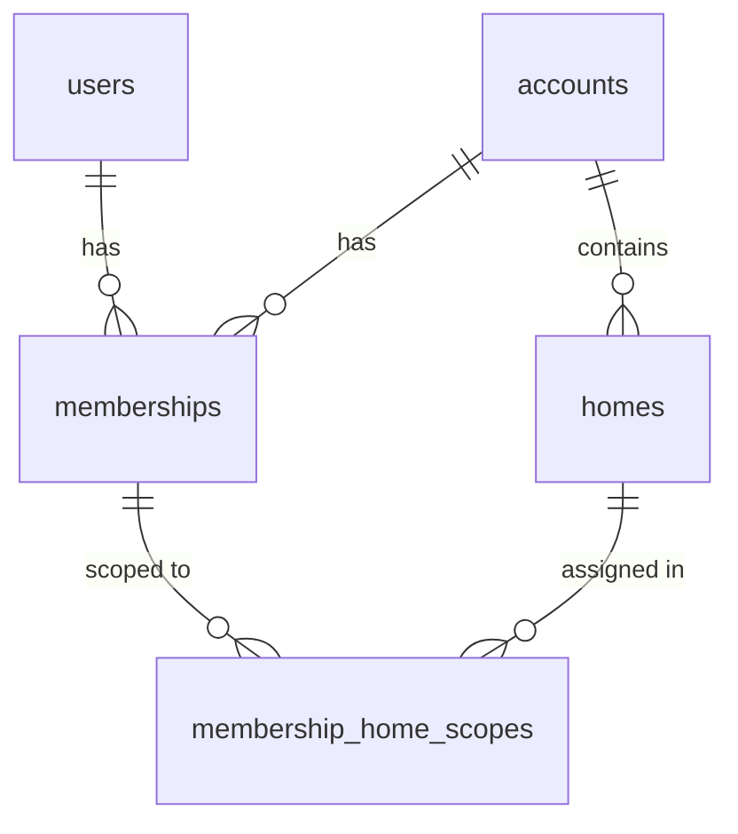
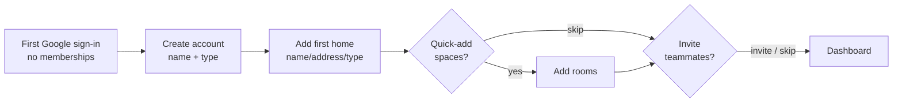
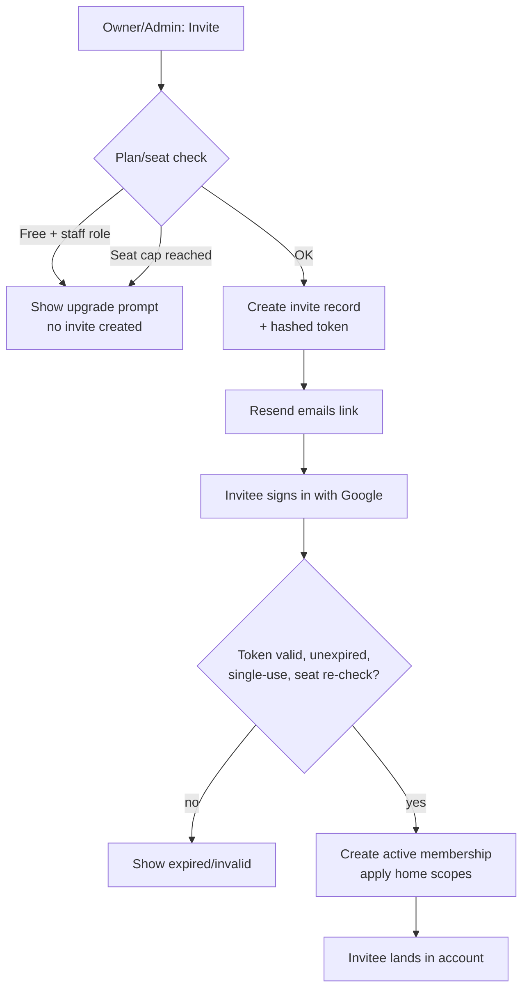

# Onboarding, Authentication & RBAC

Purpose: Specify how people sign in to MiHomes, create and join home accounts, invite teammates, and what each role is allowed to do — the identity and access foundation for MiHomes as a multi-tenant SaaS at mihomes.ai.

Status: Draft — 2026-07-27

---

## 1. Scope & Related Docs

This document owns: Google authentication, first-run onboarding, staff/teammate invitations, and the owner/admin/staff role model (RBAC) with its enforcement.

- Tenant isolation and data scoping: `../architecture/MULTITENANCY.md`
- Stripe billing and Resend email delivery: `../architecture/BILLING_AND_EMAIL.md`
- Plan limits and pricing: `PRICING_AND_PACKAGING.md`

Today the app is single-user, local-first, with **no auth and no user/account concept**. This doc defines the model we are moving to; it does not assume any of it exists yet.

**Phasing** (where this doc lands):
- **Phase 0** — landing page + waitlist + Google sign-in (identity only).
- **Phase 1** — multitenant foundation (`users`, `accounts`, `memberships`, tenant scoping).
- **Phase 2** — THIS doc's core: onboarding, invites, RBAC enforcement.
- **Phase 3** — billing (Stripe) gates seats and staff invites.
- **Phase 4** — GA.

---

## 2. Identity Model

Three global tables form the backbone. All domain data (homes, tasks, issues, staff, vendors, finances) hangs off an `account_id`.

| Table | Represents | Key fields |
|---|---|---|
| `users` | One human, globally unique | `id`, `google_sub` (unique), `email`, `name`, `avatar_url`, `created_at`, `last_login` |
| `accounts` | A tenant — one household or one estate portfolio | `id`, `name`, `type` (`household` \| `estate`), `owner_user_id`, `plan`, `created_at` |
| `memberships` | A user's role within an account | `id`, `user_id`, `account_id`, `role` (`owner`\|`admin`\|`staff`), `status` (`active`\|`revoked`), `created_at` |

Pending invitations live in a separate `invites` table (Section 6), **not** as `memberships` rows — an invitee may have no `users` row yet, so a membership (which requires `user_id`) cannot exist until acceptance. (Cross-doc note: `MULTITENANCY.md` §3.1 currently lists an `invited` membership status; it should drop that in favor of the `invites` table.)

Key facts:
- **Identity is keyed on Google `sub`**, not email. Email is display/contact metadata and can change on Google's side without breaking identity.
- A user can belong to **multiple accounts** (e.g. an estate manager working for two families) via multiple `memberships` rows. They pick a **current account** via an account switcher (Section 7).
- **Exactly one owner per account** (`accounts.owner_user_id`), transferable (Section 8).
- Staff scoping (which homes a staff member sees) lives in a `membership_home_scopes` table: `(membership_id, home_id)`. Scope rows are only meaningful for `staff` memberships: owner/admin always see all homes (their scope set is ignored/empty by convention). For **staff, the scope set is the whitelist — a staff membership with zero scope rows sees zero homes** (fail closed, never "all"). Homes added to the account later are invisible to staff until explicitly added to their scope.



---

## 3. Authentication (Google OAuth / OIDC)

### 3.1 Provider policy
**Google OAuth (OIDC) only at launch. No passwords.** We use the standard **authorization-code flow** (with PKCE). The auth layer is abstracted behind an `IdentityProvider` interface so email/password or additional IdPs (Apple, Microsoft) can be added later without touching call sites. Launch ships exactly one implementation: `GoogleOIDCProvider`.

### 3.2 What we store
On successful sign-in we upsert a `users` row keyed on `google_sub`:
- `google_sub` — stable subject id (the identity key; never changes for a Google account).
- `email`, `name`, `avatar_url` — copied from the ID token / userinfo on each login (kept fresh).
- `created_at` (first sign-in), `last_login` (updated every sign-in).

We do **not** store Google refresh tokens unless a later feature needs Google API access; launch only needs identity, so we discard tokens after verifying the ID token.

### 3.3 Session strategy
**Decision: server-side session with a secure, httpOnly, SameSite=Lax cookie.** Justification for a FastAPI app:
- Server sessions are **revocable** — we can kill a session immediately on sign-out, role change, or membership revocation. A stateless JWT can't be revoked before expiry without a blocklist, which reintroduces server state anyway.
- The **current-account context** (Section 7) changes during a session; keeping it server-side avoids re-minting tokens on every account switch.
- httpOnly + `Secure` + `SameSite=Lax` defends against XSS token theft and most CSRF. State-changing routes additionally require a CSRF token (double-submit) since Lax still allows top-level navigations.

Session record: `session_id → {user_id, current_account_id, created_at, expires_at}`. Sliding expiry (e.g. 14 days idle, 90 days absolute — *PLACEHOLDER*). Stored in Postgres alongside the app data (Redis at scale). The `session_id` is a high-entropy random token; only a hash is stored server-side.

Important nuance: the session stores **who** and **which account is current** — never the role. Role and home scope are loaded **fresh from `memberships` on every authorized request** (§9.4), so a role change or revocation takes effect on the member's very next request, with no session invalidation required. Killing sessions outright is reserved for sign-out and account-level security events.

### 3.4 Sign-in → account resolution
After the ID token is verified and the `users` row is upserted, we resolve where the user lands:

1. Look up `active` memberships for this `user_id`.
2. **No memberships** → route to **onboarding** (Section 5) to create their first account.
3. **Exactly one** → set it as `current_account_id`, land on its dashboard.
4. **Multiple** → land on the **last-used** account (persisted per user); account switcher available.
5. Any pending `invites` matching the user's email surface as invitations to accept (Section 6) — surfaced as a convenience only; the emailed token remains the acceptance authority (§6.3).

### 3.5 Sequence diagram

```mermaid
sequenceDiagram
    actor U as User
    participant B as Browser
    participant API as MiHomes (FastAPI)
    participant G as Google OIDC

    U->>B: Click "Sign in with Google"
    B->>API: GET /auth/google/start
    API->>API: Generate state + PKCE, store in temp cookie
    API-->>B: 302 → Google authorize URL
    B->>G: Authorize (user consents)
    G-->>B: 302 → /auth/google/callback?code&state
    B->>API: GET callback (code, state)
    API->>API: Verify state, exchange code (PKCE) 
    API->>G: POST /token
    G-->>API: id_token (+ access_token)
    API->>API: Verify id_token sig/claims, read google_sub
    API->>API: Upsert users row, update last_login
    API->>API: Resolve memberships → account or onboarding
    API-->>B: Set session cookie; 302 → dashboard or /onboarding
```

---

## 4. Authorization Overview

Every authenticated request carries two pieces of context:
1. **Who** — `user_id` from the session.
2. **Where** — `current_account_id` from the session, plus the target resource's `account_id`.

Authorization is the intersection: *does this user have a membership in the target account, and does that membership's role (and home scope) permit this action on this resource?* Enforcement details are in Section 9; tenant isolation (the "same account" check) is owned by `../architecture/MULTITENANCY.md`.

---

## 5. First-Run Onboarding (New Owner)

Goal: fastest possible time-to-value. A brand-new user (no memberships) becomes an owner with one home and a live dashboard in under two minutes. Onboarding is a **guided wrapper** over existing domain operations (property/space creation) — it does not introduce new domain concepts.

| Step | Screen | Mandatory? | Captures | Creates |
|---|---|---|---|---|
| 1 | Welcome | — | — | — |
| 2 | Create account | **Yes** | Account name, type (household/estate) | `accounts` row + `owner` membership |
| 3 | Add first home | **Yes** | Home name, address, type (house/apt/estate/land) | first `homes` row |
| 4 | Quick-add spaces | Skippable | Room/space names (chips: Kitchen, Primary Bedroom, Garage…) | `spaces` rows |
| 5 | Invite teammates | Skippable | Emails + role | pending invites (Free: gated — see §6.4) |
| 6 | Land on dashboard | — | — | — |

Rules:
- Steps 2 and 3 are the only hard requirements — an account must have a name and at least one home.
- Minimize friction on the mandatory steps: **prefill** account name from the Google profile ("The <LastName> Household"), default type to `household`, and require only the home *name* in step 3 (address and type are editable later). Each mandatory screen should be completable in one tap plus at most one text field.
- Step 5 is always shown but is **not** required; skipping is a first-class path. On Free, staff invites are disabled here with an inline upgrade nudge (admin invites remain available up to the 3-seat limit).
- The account created in step 2 defaults to the **Free plan** (1 home, 3 seats, no staff invites). Billing setup is deferred (Phase 3) — never blocks onboarding.
- Onboarding is idempotent/resumable: if the user drops off after step 2, next sign-in resumes at step 3 (account exists, no home yet).



---

## 6. Inviting Staff & Teammates

Owners and admins can invite people to their account. Invites are email-based and tokenized; delivery is via **Resend** behind the `EmailProvider` interface (see `../architecture/BILLING_AND_EMAIL.md`).

### 6.1 Invite lifecycle
1. Inviter enters an **email**, chooses a **role** (`admin` or `staff` — the `owner` role can never be invited; ownership moves only via transfer, §8.1), and — for staff — selects **one or more homes** to scope to (a staff invite with zero homes is rejected; empty staff scope means no access, §2).
2. System checks the inviter's own permission (`invite users`, §9.2) and seat/plan limits (§6.4). If blocked, no invite is created; an upgrade prompt is shown.
3. An `invites` record is created: `{id, account_id, email, role, home_scopes, token_hash, expires_at, created_by, status}`. **No `memberships` row exists yet** — the invitee may not have a `users` row (they've never signed in), and `memberships` requires a `user_id`. The pending `invites` row is what consumes a seat (see `PRICING_AND_PACKAGING.md` §3.1 seat semantics).
4. Resend emails a **tokenized, single-use, expiring link** (`/invite/accept?token=…`, default 7-day expiry *(PLACEHOLDER)*). The raw token exists only in the email; we store its hash.
5. Invitee clicks → signs in with Google (users row upserted) → we validate the token (hash match, unexpired, status `pending`) → **transactionally**: mark the invite `accepted` (single-use enforced here — a second acceptance attempt finds status ≠ `pending` and fails), create the `active` membership with the invite's role, apply home scopes, re-check the seat limit. If the invitee already has a membership in the account, acceptance fails with "already a member" — an invite can never change an existing member's role or scope.

### 6.2 Pending / resend / revoke
- **Pending** invites are listed in account settings with email, role, scope, status, and expiry.
- **Resend** issues a fresh token (replacing the stored hash, so the old link stops working) and re-emails; expiry resets. It does not consume an additional seat.
- **Revoke** marks the invite `revoked`; the token stops working immediately and the seat is freed.
- **Expiry** is equivalent to revoke: an expired invite frees its seat and its token is dead; the inviter can re-invite.

### 6.3 Email-mismatch policy
The invite is sent to `alice@work.com`, but Alice signs in with Google as `alice@gmail.com`. Recommended policy:
- The token is the **authority**, not the email. Whoever holds a valid token and completes Google sign-in may accept — this handles the common "my Google account uses a different address" case without friction.
- Be honest about the tradeoff: the token is then a **bearer credential** — a forwarded email is a forwarded invite. Mitigations that ship with the token-authoritative default: single-use + 7-day expiry bound the window; the acceptance screen shows "invited as `alice@work.com` — you're signing in as `alice@gmail.com`, continue?" so a wrong recipient self-identifies; and on any mismatch acceptance we **notify the inviter** ("your invite to alice@work.com was accepted by alice@gmail.com — remove them if this is wrong"), which pairs with instant removal (§8.2).
- On acceptance we **record both** the invited email and the accepting `google_sub`/email in the audit log.
- Tighten later with an optional "email must match" toggle for security-sensitive accounts. Launch default: token-authoritative.

### 6.4 Seat & plan enforcement (at invite time)
- **Free plan = 1 home, 3 seats, NO staff invites.** On Free, the "Invite staff" action is visible but **gated** with an upgrade prompt — inviting staff is itself an **upgrade trigger** to Pro.
- Admin invites still count against the **seat** limit (owner + active members + pending invites — see `PRICING_AND_PACKAGING.md` §3.1 for the exact seat definition); hitting the seat cap shows an upgrade prompt.
- Limits are checked via the **entitlements service** (`can(account, "invite", …)`) — never hardcoded in the invite flow.
- Primary enforcement is **at invite creation**, so a user is never emailed an invite that can't be honored; acceptance **re-checks** transactionally to close the race where the plan was downgraded between send and accept (an invite over the new limit fails acceptance with a clear message).



---

## 7. Account Switching

A user with multiple memberships has one **current account** at a time.

- **Account switcher** in the top nav lists every account the user has an `active` membership in, showing account name, type, and the user's role there.
- Selecting an account updates `session.current_account_id` (server-side) and persists it as the user's `last_used_account`.
- **All subsequent requests are scoped to the current account.** Data, navigation, and permissions reflect only that account; nothing leaks across accounts (`../architecture/MULTITENANCY.md`).
- Role is **per membership**: the same person may be `owner` in one account and `staff` in another. The RBAC check always uses the membership for the *current* account.

---

## 8. Owner Transfer & Offboarding

### 8.1 Transfer ownership
- Only the current owner can transfer. Target must be an `active` member of the account (typically promoted to `admin` first).
- On transfer: `accounts.owner_user_id` → new user; old owner's membership is downgraded to `admin` (or removed, at their choice). Billing control follows ownership.
- **Last-owner invariant:** an account must always have exactly one owner. Ownership can be transferred but never left vacant.

### 8.2 Removing a member
- Owner/admin can remove members (admins cannot remove the owner).
- **Data created by a removed member stays with the account** — tasks, notes, issues, uploads are owned by the *account*, not the individual. Removal revokes access, not data.
- Removal sets the membership `revoked` and drops home scopes. Sessions are per-user, not per-account, so we don't kill the session — the next request re-loads the membership (§9.4), finds it revoked, and denies; if it was their `current_account`, they're bounced to the account switcher (or onboarding if they have no other memberships). Effect is immediate.

### 8.3 A staff member leaving
- Staff can be removed by owner/admin, or can leave voluntarily (removes their own membership).
- Their home-scope rows are deleted; their contributions remain attributed but access ends immediately.
- Removing a staff member frees a seat.

---

## 9. RBAC Model & Enforcement

### 9.1 Roles (canonical)
- **owner** — created the account (or had it transferred). Sole billing controller; can delete the account; full access; can invite/manage anyone. Exactly one per account (transferable).
- **admin** — full operational control across **all homes** in the account; can invite staff and other admins. **Cannot** manage billing or delete the account.
- **staff** — invited external help (housekeeper, property manager, handyman coordinator). **Scoped** access: specific home(s) + a default capability set. Cannot see billing, cannot invite others, cannot see homes they aren't assigned to.

### 9.2 Capability matrix

| Action | owner | admin | staff |
|---|:---:|:---:|:---:|
| View home | ✓ | ✓ | scoped |
| Edit home settings | ✓ | ✓ | ✗ |
| Add home (plan-gated) | ✓ | ✓ | ✗ |
| Delete home | ✓ | ✓ | ✗ |
| Manage tasks | ✓ | ✓ | scoped |
| Manage issues / work orders | ✓ | ✓ | scoped |
| Manage inventory & documents | ✓ | ✓ | scoped |
| Manage vendors | ✓ | ✓ | scoped |
| View finances (budgets, expenses, contracts) | ✓ | ✓ | ✗ |
| Manage staff (invite/remove/re-scope) | ✓ | ✓ | ✗ |
| Invite users (admin/staff) | ✓ | ✓ | ✗ |
| Revoke/resend pending invites | ✓ | ✓ | ✗ |
| Change a member's role | ✓ | ✓ *(not owner's, not own)* | ✗ |
| Transfer ownership | ✓ | ✗ | ✗ |
| Manage billing (checkout, portal, plan changes) | ✓ | ✗ | ✗ |
| Delete account | ✓ | ✗ | ✗ |
| View audit log | ✓ | ✓ | ✗ |
| Use AI advisor | ✓ | ✓ | scoped |
| Export data | ✓ | ✓ | ✗ |
| Link chat gateway (WhatsApp/Telegram) for self | ✓ | ✓ | ✓ *(scoped access applies)* |

**scoped** = allowed only for the home(s) the staff membership is assigned to, and only within that home's data. Actions that are **account-level** (billing, invites, account deletion, audit, export, finances) have no meaningful "scoped" variant — for staff they are ✗ outright. Every new route must declare one of these actions (or add a row here); an undeclared action is a deploy-time error, not a silent allow.

### 9.3 Default staff permission set
By default a staff member can, **within their assigned home(s) only**: view the home, view and manage tasks assigned to or created within that home, log issues, view/contact vendors for that home, and use the AI advisor limited to that home's context. They cannot edit core home settings, see finances, see other homes, invite anyone, or touch billing. This default is intentionally conservative and **refinable later** via per-home, per-capability assignment (e.g. a property manager granted vendor-management but not a handyman).

Staff scoping is enforceable because **every scoped domain object resolves to exactly one home** (task → home, issue → home, vendor link → home, etc.); the scope check is "is this object's home in my scope set." Objects that do *not* belong to a home (account-level vendors, budgets, account settings) are account-level and therefore ✗ for staff by the matrix above. **AI scoping is a retrieval constraint, not a prompt nicety:** the advisor's context assembly for a staff request may only query data the same `require_permission` checks would allow — cross-home data must be excluded at the query layer, so a staff member cannot exfiltrate another home's data by asking the AI about it.

### 9.4 Enforcement

Authorization is a single check at the **service/route layer**, before any business logic runs:

```
require_permission(user, current_account, action, target_home=None)
```

1. **Tenant scope first** — confirm `target.account_id == session.current_account_id` (delegated to multitenancy layer). Cross-account access is impossible by construction; a mismatched target is a 404, not a 403 (don't reveal existence).
2. **Load membership** — fetch the user's `active` membership for the current account, **fresh from the DB on every request** (role is never cached in the session — §3.3). None → deny and clear `current_account_id` (the membership was revoked mid-session).
3. **Role capability** — look up `(role, action)` in the capability matrix. `✗` → deny.
4. **Home scope** — if the capability is `scoped` (staff), confirm `target_home` is in the membership's `membership_home_scopes`. Not in scope → deny (404). Staff list/index queries are filtered to scoped homes at the query layer, not post-hoc.
5. **Entitlements are a separate gate.** RBAC answers "may this *role* do this"; the entitlements service (`PRICING_AND_PACKAGING.md` §3) answers "may this *account* do this on its plan." Actions that create limited resources (add home, invite, AI call) pass **both** checks; a permission grant never bypasses a plan limit or vice versa.

This composes cleanly with tenant scoping: a user **only ever acts within one current account**, so every check reduces to "role + home scope within this account." The matrix is the single source of truth — routes declare the `action` they require; the check is centralized (FastAPI dependency), not scattered per-handler. Every deny and every privileged action (invites, role changes, ownership transfer, deletion) writes to the audit log.

---

## 10. Edge Cases & Security

- **Revoked Google access / disabled Google account** — sign-in fails at Google, so no *new* session can be created. Existing sessions are ours, not Google's, and stay valid until expiry — we don't hold Google tokens to re-check (§3.2). Accepted risk, bounded by the 14-day idle expiry; the real mitigations are ours: an owner/admin removing the member kills their access on the next request (fresh membership load, §9.4), and a future periodic silent re-auth (`prompt=none`) can shrink the window if needed. "Sign out everywhere" (delete all of a user's sessions) ships with launch as the user-side kill switch.
- **Email changed on Google's side** — `google_sub` is the key, so identity is preserved; we simply update the stored `email` on next login. Nothing breaks.
- **Two Google accounts, same person** — different `sub` = different `users` rows = two identities. We do not auto-merge; account linking is an explicit future feature (open question).
- **Invite token security** — tokens are single-use, expiring (7 days), scoped to one account+role, stored **hashed** (`token_hash`), and delivered only via email. Resend or revoke invalidates prior tokens immediately.
- **Privilege escalation** — a staff member can never change their own role or scope; role/scope changes require `manage staff` (owner/admin) and are checked server-side, never trusted from the client. Nobody can change their **own** role; the `owner` role can never be assigned by role-change or invite — only by ownership transfer (§8.1). Admins cannot modify the owner's membership or touch billing. Invite `role` is fixed at creation and applied verbatim at acceptance; a tampered acceptance request cannot upgrade it.
- **Last-owner problem** — the sole owner cannot be removed and cannot demote themselves; they must first transfer ownership. Account deletion is the owner's only path to "leaving."
- **Seat-limit races** — invite creation and acceptance both re-check limits transactionally so concurrent invites can't exceed the cap.
- **Session fixation / CSRF** — rotate `session_id` on login; state-changing routes require a CSRF token alongside the SameSite=Lax cookie.

---

## 11. Open Questions

1. **Account linking** — should we let one person merge two Google identities (personal + work `sub`) into a single `users` record? Deferred; needs a secure verification flow.
2. **Granular staff capabilities** — when do we ship per-capability staff permissions (vs. the single default set)? Which capabilities are worth exposing first (vendor management? task-only?)?
3. **Non-Google invitees** — if we add email/password before an invitee has Google, how does acceptance work across IdPs? The `IdentityProvider` abstraction anticipates this but the acceptance UX is unspecified.
4. **Owner offboarding on churn** — if an owner stops paying and doesn't transfer, what's the grace/lock/delete timeline? (Coordinate with `../architecture/BILLING_AND_EMAIL.md`.)
5. **Cross-account staff seat accounting** — an estate manager in two Pro accounts consumes a seat in each; is that the right model, or should there be a shared "professional" identity concept?
6. **Audit log retention & export** — how long do we keep audit entries, and is the audit log itself exportable per §9.2?
