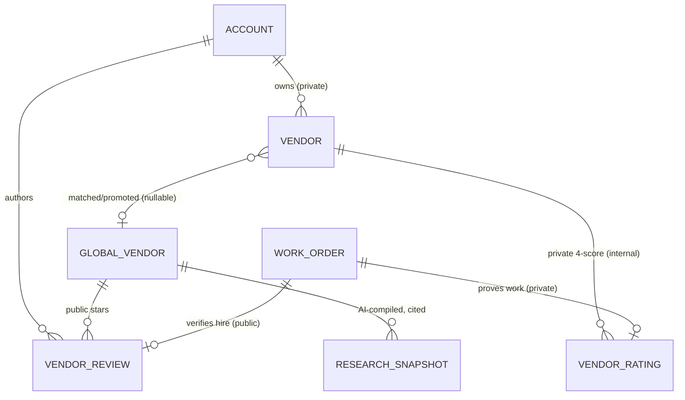

# Vendor Discovery & Community Ratings

Purpose: Specify a Vendor Discovery marketplace layered on top of MiHomes — AI-driven vendor research, a cross-tenant public directory, and community star ratings — turning the private per-owner vendor list into a shared reputation layer and a potential second revenue engine.

Status: Draft — 2026-07-27

> This is a **growth bet**, not core MVP. A marketplace is a materially bigger commitment than a feature: it carries cold-start, moderation, and legal cost that a single-tenant tool does not. Everything here is Phase 4+ / fast-follow. Nothing in this doc should block Phases 0–3 (see `../architecture/MULTITENANCY.md` §phasing and `ONBOARDING_AUTH_RBAC.md`).

---

## 1. Scope & Related Docs

This document owns: the AI vendor deep-research pipeline, the global (cross-tenant) vendor directory, public star reviews, and homeowner discovery UX.

- Tenant isolation and the deliberate cross-tenant exception: `../architecture/MULTITENANCY.md`
- Plan gating (Free / Pro / Estate) and AI usage limits: `PRICING_AND_PACKAGING.md`
- Roles (owner / admin / staff), invites: `ONBOARDING_AUTH_RBAC.md`
- Billing (Stripe) and transactional email: `../architecture/BILLING_AND_EMAIL.md`
- Chat entry points (find-a-vendor from a phone): the Telegram / WhatsApp / Twilio gateway PRDs.

Canon inherited from the doc set: plans **Free / Pro / Estate**; roles **owner / admin / staff**; multi-tenant **shared Postgres with `account_id`**; AI via the existing **Claude / OpenAI / NIM / Ollama** provider abstraction (`src/mihomes/services/ai/provider.py`); domain **mihomes.ai**.

---

## 2. Vision & the two-sided opportunity

Today MiHomes helps an owner *manage* the vendors they already know. Discovery helps them **find the ones they don't** — a plumber, electrician, landscaper, cleaner, pool service, HVAC tech, or handyman near a specific home — and decide who to trust using both AI-compiled facts and the lived experience of other MiHomes customers.

Two sides, two kinds of value:

| Side | What they get | Why they care |
|---|---|---|
| **Homeowner (demand)** | AI-vetted shortlists, community stars, one-tap "add to my vendors → work order" | Removes the worst chore of estate management: cold-sourcing a trustworthy trade |
| **Vendor (supply)** | A claimable profile in front of high-intent, high-value homeowners | Qualified leads without ad spend |

**Second revenue engine.** Subscriptions (Pro/Estate) remain the core business. Discovery opens a *distinct* line: vendor lead-gen, featured/sponsored placement, verified-vendor badges, and referral fees on completed work. See §8. This is upside, not the plan of record — we monetize the homeowner value first and only turn on vendor-side revenue once the directory has density.

**Clear-eyed caveat.** A two-sided marketplace has to solve cold-start (§8) and ongoing moderation/legal cost (§7). We enter it deliberately, staged, and reversible — the AI research pipeline (§4) is valuable to a *single* tenant even if the public directory never reaches critical mass, so we sequence that first.

---

## 3. Current state → target

### 3.1 What exists today (verified against code)

- **`Vendor`** (`src/mihomes/models/vendor.py`) — a private contact record: `company_name`, `contact_name`, `phone`, `email`, `service_categories` (JSON), `service_areas` (JSON), `contacts` (JSON list), `website`, `license_number`, `insurance_info`, `notes`, `active`, `property_ids`. Slug-identified. Post-multitenancy this is scoped by `account_id` — one household's private rolodex.
- **`VendorRating`** (`src/mihomes/models/vendor_rating.py`) — a **private, internal** appraisal: `vendor_id`, `work_order_id`, `property_id`, four 1–5 integer scores (`quality_score`, `reliability_score`, `cost_score`, `communication_score`), computed `overall_score`, `notes`, `rated_date`. Created via `rate_vendor()` / `create_rating()` in `src/mihomes/services/vendor.py` and `src/mihomes/services/vendor_rating.py`. It is the owner's private scorecard — never shared.
- **Canonical taxonomy** — `SERVICE_CATEGORIES` (34 categories) and `_CATEGORY_MAP` normalization live in `src/mihomes/services/vendor.py`. The directory reuses this exact list so private and public vendors speak the same category language.
- **AI layer** — a `Vendor Strategist` role already exists (`src/mihomes/services/ai/roles.py`, `name="vendor_strategist"`), plus an agentic tool loop (`src/mihomes/services/ai/agent.py`) and a `query_vendors` tool (`src/mihomes/services/ai/tools.py`). Discovery extends these rather than inventing a parallel stack.

### 3.2 Target: private vendor vs. global profile

We introduce a hard distinction:

- **Private `Vendor`** — unchanged: an account's own contact, tenant-scoped. Still the source of truth for "who I hire."
- **`GlobalVendor`** — a single, cross-tenant directory profile for a real-world business (one row per business, shared by all accounts). AI-compiled and/or vendor-claimed.
- **Link** — a private `Vendor` may be *matched/promoted* to a `GlobalVendor` (a nullable `global_vendor_id` FK on `Vendor`). Promotion is an owner action ("this is my guy → he's in the directory") or an AI-suggested match on name + phone + service area. Unmatched private vendors stay fully private.

New public review type, distinct from the private 4-score `VendorRating`:

- **`VendorReview`** — a single-dimension **1–5 star** public review with free text, attributed to an account/membership, with a `verified_hire` flag (a linked `work_order_id`, mirroring how `VendorRating.work_order_id` proves real work happened). This is the community reputation layer; `VendorRating` stays private.

### 3.3 Data-model sketch



| Model | Tenancy | Key fields (new) | Notes |
|---|---|---|---|
| `Vendor` (exists) | `account_id`-scoped | + `global_vendor_id` (nullable FK) | Private contact; optional link to directory |
| `VendorRating` (exists) | `account_id`-scoped | *(unchanged)* | Stays private, 4 scores, work-order-linked |
| `GlobalVendor` (new) | **GLOBAL — no `account_id`** | `company_name`, `slug`, `service_categories`, `service_areas`/geo, `website`, `phone`, `license_number`, `verification_status` (`ai_generated` / `verified` / `claimed` — the `status` referenced in §4.1/§4.4), `claimed_by_account_id` (nullable), `ai_confidence`, `source_citations` (JSON), `avg_stars`, `review_count`, `last_researched_at` | One row per real business, cross-tenant |
| `VendorReview` (new) | authored by `account_id`, **attached to global row** | `global_vendor_id`, `account_id`, `author_membership_id`, `stars` (1–5), `body`, `work_order_id` (nullable), `verified_hire` (bool), `status` (published/flagged/removed), `created_at` | Public community reputation |
| `ResearchSnapshot` (new) | GLOBAL | `global_vendor_id`, `payload` (structured JSON), `citations`, `model`, `confidence`, `created_at` | Immutable audit trail of each AI research run |

### 3.4 Multi-tenancy: a deliberate exception

`../architecture/MULTITENANCY.md` mandates strict `account_id` scoping on every domain row. **`GlobalVendor`, `ResearchSnapshot`, and the aggregate side of `VendorReview` are an intentional exception**: the directory is shared across all tenants — that shared knowledge *is* the product. Rules to keep the exception safe:

- `GlobalVendor` / `ResearchSnapshot` carry **no** `account_id`; they are world-readable to authenticated users. They do **not** get the `TenantOwned` mixin or RLS tenant policies — they are read-only to request handlers and writable only by the research pipeline, moderation, and claim flows (mirroring the tenancy doc's rule that `users`, the other global table, is written only by auth flows).
- `VendorReview` rows **do** carry `account_id` (the author) and are write-scoped to that account; only their aggregation and published body are public. Author identity is displayed as a coarse label (e.g. "Verified MiHomes customer in <region>"), never raw account identity, plan tier, email, or property address. Region granularity must be coarse enough (metro, not town) that region + review text cannot deanonymize the author to the vendor.
- Nothing tenant-private (a `Vendor`'s `notes`, `contacts`, `insurance_info`, or a `VendorRating`) ever crosses into the global tables except by an explicit owner "publish" action (§5.3).
- This exception must be called out explicitly in `MULTITENANCY.md` (which currently states "`users` is the only global business table" — that sentence needs amending) so it is not mistaken for a scoping bug.
- The CI-gated isolation test extends to cover the exception: global tables are readable by any account but writable by none through general request paths; `VendorReview` write access is provably scoped to the authoring account.

---

## 4. AI deep-research pipeline (flagship)

The differentiator: the AI does the legwork. Input a **category + location/service area**; the agent searches the web, visits vendor sites, aggregates public reputation signals, extracts structured facts, and emits a **cited, confidence-scored `GlobalVendor` profile**.

### 4.1 Agentic flow

```
Input: {category, location | property_id → service_area, radius, count}
  │
  ▼
[1] Candidate discovery ── web_search("<category> near <area>")
  │        → list of candidate businesses (name, url, phone)
  ▼
[2] Per-candidate enrichment (parallel, capped)
  │   web_fetch(site) → extract services, service_areas, license, contact
  │   web_search(reviews) → aggregate rating SIGNALS + source LINKS (not copied text)
  ▼
[3] Extraction → structured_output(schema)  [provider.structured_output]
  │   normalize categories against SERVICE_CATEGORIES (src/mihomes/services/vendor.py)
  ▼
[4] Scoring → ai_confidence (source count, agreement, recency, license verifiable?)
  ▼
[5] Upsert GlobalVendor + ResearchSnapshot (dedupe on name+phone+geo)
  │   status = ai_generated (NOT live)
  ▼
[6] Human-in-the-loop review (§4.4) → status = verified → live in directory
```

### 4.2 Maps onto existing AI infrastructure

- **Provider abstraction** — `get_provider()` in `src/mihomes/services/ai/provider.py` (supports `claude`/`openai`/`ollama`/`nim`); use `structured_output()` for the extraction step. Research is best run on a strong hosted model (Claude/OpenAI); local (Ollama/NIM) is a fallback where cost dominates over quality.
- **Role** — extend the existing `vendor_strategist` role (`src/mihomes/services/ai/roles.py`) or add a sibling **NEW** `vendor_researcher` role with a research-specific system prompt (bias toward citations, refuse to state unsourced facts — the roles already carry the "say nothing rather than guess" guardrail from `_base_prompt`). Only `vendor_strategist` exists today; `vendor_researcher` is proposed, not built.
- **Agent loop** — reuse `agent_stream()` (`src/mihomes/services/ai/agent.py`) and its `("status", …)` progress events ("Searching…", "Reading acme-plumbing.com…") exactly as the loop already does for DB tools. Two known gaps to close first: `MAX_TOOL_ROUNDS = 5` is a module constant (make it a parameter to raise the cap for multi-candidate research), and `agent_stream()` is currently **hardwired to the Anthropic SDK**, bypassing the provider abstraction — research either accepts Claude-only for the agentic phase or the loop is ported onto `AIProvider` first.

### 4.3 New tools required

The current `TOOL_SCHEMAS` (`src/mihomes/services/ai/tools.py`) are all read-only DB queries (`query_vendors`, `query_work_orders`, etc.). Research needs **outbound** tools — all four below are **NEW / proposed**, added to the same registry:

| Tool (NEW) | Purpose | Notes |
|---|---|---|
| `web_search` | Find candidate vendors & review-source links | Via a search API; return links + snippets, not scraped pages |
| `web_fetch` | Read a vendor's own website (first-party) | Respect robots.txt; first-party pages are the safest source |
| `extract_profile` | LLM structured extraction into the schema below | Wraps `provider.structured_output` |
| `geocode_service_area` | Normalize "near <home>" to a radius/region | Builds on the existing `geocode_address()` in `src/mihomes/services/weather.py`, which already geocodes `Property.address` |

Outbound tools are a new risk class for this codebase: today the agent can only read the tenant's own DB. `web_fetch` needs SSRF protections (public-IP-only, scheme allowlist, size/time caps) and both tools need per-run budget caps enforced in the tool layer, not just in the prompt.

### 4.4 Output schema, caching, human-in-the-loop, cost control

**Structured output** (`extract_profile`) — every non-obvious fact must carry a source:

```json
{
  "company_name": "…", "phone": "…", "website": "…",
  "service_categories": ["Plumbing"],
  "service_areas": ["Aspen, CO", "Snowmass"],
  "license_number": "…", "license_verified": false,
  "pricing_signal": "mid-market | premium | budget | unknown",
  "external_review_summary": {"source": "Google", "stars": 4.6, "count": 210, "url": "https://…"},
  "citations": [{"claim": "24/7 emergency service", "url": "https://…"}],
  "ai_confidence": 0.0
}
```

- **Caching / refresh** — the same local plumber is researched **once, shared across all tenants** (the whole point of a global directory). This is safe under the §3.4 exception because a research run's inputs and outputs contain **only public-web facts** — never the requesting account's identity, properties, or private vendor data; the cache key is `(business identity, category)`, not anything tenant-derived, and the requesting `account_id` is recorded only in that account's own usage metering, not on the shared row. `last_researched_at` gates refresh; refresh cadence ~90 days *(PLACEHOLDER)*, or on-demand for claimed/high-traffic profiles. A `ResearchSnapshot` is retained per run for provenance and diffing.
- **Human-in-the-loop** — an AI-generated profile is **never** auto-published. It sits in `ai_generated` until (a) an internal moderator promotes it, or (b) the vendor claims and confirms it (§7). Until then it can appear only in the requesting owner's *private* shortlist, clearly labeled "AI-compiled, unverified." Mechanically: directory search filters to `status = verified`; the requester's shortlist is an account-scoped record pointing at the not-yet-live global row (the row itself stays statusless-global, only its *discoverability* is gated).
- **Cost control** — deep research is expensive (many model calls + fetches):
  - Gate to paid plans (Pro/Estate) per `PRICING_AND_PACKAGING.md`. One research *run* is many model calls, so it cannot be metered as one "AI call" under the pricing doc's current unit — count a run as a fixed multiple of AI calls (e.g. 10 *(PLACEHOLDER)*) or add a separate `research_runs` meter; `PRICING_AND_PACKAGING.md` §5 must be updated either way.
  - Rate-limit runs per account per day.
  - **Shared cache is the primary cost lever** — a cache hit on an existing `GlobalVendor` is free and instant (and metered as a normal query, not a run).
  - Cap candidates per run (e.g. 8 *(PLACEHOLDER)*) and fetches per candidate, enforced in the tool layer (§4.3).

---

## 5. Ratings & reviews system

### 5.1 The public star review

- **Scale:** integer **1–5 stars** plus free-text body (single dimension — deliberately simpler than the private 4-score `VendorRating`, because a public number people scan should be one number).
- **Who can review:** default to **verified hires only** — the reviewer's account has a `WorkOrder` linked to a `Vendor` matched to this `GlobalVendor`. This mirrors `VendorRating.work_order_id` and is the single strongest anti-fraud lever. **Honest limit:** work orders are self-created tenant data, so "verified hire" proves *plausible* work history, not payment — a determined faker can fabricate a work order. It raises fraud cost; it is not proof. Compensating checks: the work order must predate the review by a minimum age, the account must have organic history (properties, tasks, tenure), and paid-plan accounts weigh higher. Non-hire "impressions" may be allowed later, clearly badged and excluded from the headline average.
- **One review per account per vendor**, editable, timestamped.

### 5.2 Aggregation, display, ranking

- Headline `avg_stars` + `review_count`, weighted toward **verified-hire** and **recent** reviews; suppress the average below a minimum count (show "Not enough reviews yet").
- Default ranking blends: stars × verified-hire ratio × review volume × freshness × `ai_confidence`. Sponsored placement, if ever enabled, is **visually distinct and labeled** (§8), never blended silently into the "top rated" sort.

### 5.3 Public stars vs. private `VendorRating` — how they interplay

Both persist; they serve different jobs.

| | `VendorRating` (private) | `VendorReview` (public) |
|---|---|---|
| Audience | Owner's account only | Every MiHomes customer |
| Dimensions | 4 scores (quality/reliability/cost/comm) | 1 star + text |
| Proof | `work_order_id` (private) | `verified_hire` via linked work order |
| Default visibility | Never shared | Public |

The private rating can **feed** the public layer: when an owner rates a matched vendor, we offer "share this as a public review" — a one-tap **opt-in** that maps the 4 scores to a star (e.g. rounded `overall_score`) and prompts for a short public blurb. Absent opt-in, the private rating stays private and only influences that owner's own shortlisting.

### 5.4 Abuse & trust

| Threat | Mitigation |
|---|---|
| Fake / paid reviews | Verified-hire gate; velocity/anomaly detection; new-account throttles |
| Vendor self-reviews | Block reviews from an account that has **claimed** the profile; block on shared payment/identity signals (email domain, phone, Stripe identity). Note the claim-block alone is weak — a vendor can simply not claim and review from a fresh account — so the verified-hire gate plus new-account throttles are the real defense |
| Review-bombing | Rate limits; require text over N chars; freshness weighting; temporary freeze on sudden spikes |
| Defamation / off-topic | Moderation queue, report button, vendor right-of-reply (§7) |
| Retaliation | Never expose the reviewer's raw identity to the vendor |

Moderation is a mix of automated flags and human review; every state transition is written to an audit trail following the `record_change` pattern already used by the vendor services — but note the existing `audit_log` is **per-account** under `MULTITENANCY.md`, while moderation acts on global rows, so moderation events need a global/ops audit table (same shape, no `account_id`) rather than any single tenant's log.

---

## 6. Discovery UX

### 6.1 Browse & search

Search the **global directory** by category (the canonical `SERVICE_CATEGORIES`), location/near-a-home, minimum stars, and `verified`/claimed filters. Results are directory cards: name, category, stars + count, distance, verified badge.

### 6.2 Vendor profile page

One page combining AI-compiled facts (each labeled **AI-compiled** vs **verified**, with citation links), community stars + reviews, license/insurance signals, service area, and a primary **"Contact / Hire"** CTA that flows into "add to my vendors."

### 6.3 AI advisor & chat gateways

- In-app advisor: *"find me a plumber near <home>"* routes to the `vendor_strategist`/`vendor_researcher` role and runs discovery, returning a shortlist inline.
- From a phone: the same intent arrives via the Telegram / WhatsApp / Twilio gateways (see their PRDs) and returns a compact ranked shortlist with tap-to-add.

### 6.4 Ties into existing flows

```
Open Issue ──"find a vendor for this"──▶ AI shortlist (category inferred from issue)
                                          │  add to my vendors  (promote → GlobalVendor)
                                          ▼
                                   private Vendor ──▶ create Work Order ──▶ (later) rate → opt-in public review
```

This closes the loop the app already models — `Issue` → `WorkOrder` → `VendorRating` — by feeding a *sourced* vendor into the front of it instead of a cold guess.

---

## 7. Legal, data-provenance & ethics

This section is load-bearing; do not hand-wave it.

- **Third-party review scraping (Google/Yelp/etc.):** copying review *content* wholesale risks ToS violation and copyright/DB-right exposure. **Recommendation: aggregate LINKS + citations and first-party data, not copied text.** Store "4.6★ on Google (210 reviews) → [link]," not the reviews themselves. Caveat: even the *numeric* aggregate is restricted — Google's and Yelp's ToS prohibit scraping ratings too, and their official APIs impose display/attribution/caching rules (e.g. Places API data generally may not be stored long-term). So the `external_review_summary` field (§4.4) is lawful only when sourced via an official API under its terms, or reduced to a bare link with no cached numbers. Prefer official APIs/licensed feeds; treat first-party vendor sites as the primary source; this needs counsel sign-off before D0 ships external summaries at all.
- **Storing business contact data:** business contact info is lower-risk than consumer PII, but a named sole-proprietor's details can still be personal data — handle under §GDPR/CCPA below.
- **Review liability / defamation:** MiHomes hosts user statements; keep clear takedown/dispute paths, a vendor right-of-reply, and never present opinion as verified fact. Retain moderation records. Two distinct exposures: (a) *user* reviews — platform-liability protection (e.g. US CDA §230) generally covers hosting third-party statements but weakens if we editorialize or selectively rewrite them, so moderate by policy, don't rewrite; (b) *AI-compiled* profile content is **MiHomes' own speech** — no §230 shield — which is precisely why unsourced claims are dropped and nothing goes live without the human/claim gate (§4.4). Also comply with review-platform law (e.g. US Consumer Review Fairness Act: never suppress negative reviews under contract; FTC rules banning fake/incentivized reviews).
- **Claim-this-listing flow:** a vendor can **claim** their `GlobalVendor` profile (identity + business verification), then correct facts, respond to reviews, and set `verification_status = claimed`. Claiming blocks self-reviews (§5.4) and is the gateway to vendor-side monetization (§8).
- **GDPR/CCPA:** honor access/deletion for vendor personal data; provide an unclaimed-profile removal/opt-out request path; document lawful basis (legitimate interest for business listings) and retain provenance to justify each stored fact.
- **AI accuracy / hallucination:** AI-compiled profiles **must cite sources** and be visibly labeled **AI-generated vs verified**. Unsourced claims are dropped, not published. `ai_confidence` is shown. The human-in-the-loop gate (§4.4) exists precisely so a hallucinated license number or phone never silently goes live.

---

## 8. Monetization options

| Model | Who pays | Trigger | Recommendation |
|---|---|---|---|
| **Subscription-gated discovery** | Homeowner | Pro/Estate unlock AI research + directory depth | **Start here** — funds the AI cost, aligns with existing plans |
| **Claimed profile (free)** | Vendor | Claim & manage listing | Free — drives supply-side signup and directory accuracy |
| **Featured / sponsored placement** | Vendor | Pay for labeled promoted slots | Later — only once search has real traffic; always labeled |
| **Verified badge** | Vendor | Paid identity + license/insurance verification | Later — trust product, modest recurring fee |
| **Lead / referral fees** | Vendor | Per qualified lead or per completed work order | Later — needs hire-through tracking (the `WorkOrder` link enables it) |
| **Affiliate** | Third party | Referrals to insurance/warranty/etc. | Opportunistic |

**Phased monetization:** homeowner-value first (subscription-gated research), monetize the vendor side only after the directory has density. Turning on vendor payments before there is traffic sells access to an empty room.

**Cold-start / chicken-and-egg.** A marketplace needs both sides at once. MiHomes has a rare unfair advantage: **its existing customers' private `Vendor` lists** — real businesses, real categories, real service areas — can **seed** the directory. Seeding rules: explicit, per-list or per-vendor owner **consent** (opt-in, never a buried ToS clause or a default-on toggle), **anonymize** the contributing account, contribute only business-facing facts (`company_name`, categories, service areas, website, public phone — never the owner's private `notes`, `contacts`, `insurance_info`, or `VendorRating`), and let vendors claim/correct. **Second consent problem:** the *vendor* never consented either — a seeded listing publishes a business's (sometimes a sole proprietor's personal) contact details. Mitigations: seed only facts corroborated by public sources (the vendor's own website/public listing) rather than raw rolodex entries, notify the vendor where a contact channel exists, and honor the §7 opt-out/removal path from day one. This bootstraps supply density before any public launch.

---

## 9. Phasing & success metrics

Discovery is **Phase 4+** (post-GA). Internal staging:

| Stage | Ships | Gate |
|---|---|---|
| **D0** | AI research for the owner's **own private shortlist** (no public directory yet) | Pro/Estate; reuses agent loop + new web tools |
| **D1** | Public `GlobalVendor` directory (seeded from consented private lists) + browse/search | Moderation + claim flow ready |
| **D2** | `VendorReview` public stars (verified-hire gated) + private→public opt-in | Trust/abuse tooling live |
| **D3** | Vendor-side monetization (claim → featured / verified / leads) | Directory density + traffic thresholds met |

**Metrics**

- *Research/supply:* vendors researched, `GlobalVendor` profiles created, cache-hit rate, mean `ai_confidence`, vendor claims.
- *Demand/engagement:* discovery searches, shortlist views, "add to my vendors" adds.
- *Reputation:* reviews submitted, % verified-hire, moderation/flag rate.
- *Funnel (north star):* **discovery → work_order conversion** (a sourced vendor that becomes real hired work) and hire-throughs.
- *Cost:* AI $ per profile, $ per active discovery user.

---

## 10. Open questions & risks

- **Cold-start:** will seeded private lists give enough density per metro to be useful, or is coverage patchy outside the founding customers' regions?
- **Geographic coverage:** research quality varies by market; thin markets may never reach a credible review count.
- **Moderation cost:** human moderation scales with reviews and claims — budget and staffing are unresolved.
- **Legal exposure:** third-party review aggregation needs counsel sign-off **before D0** (external summaries are stored even for private shortlists); defamation/hosting posture before D1. The links-not-content stance (§7) is a recommendation, not a ruling.
- **AI accuracy at scale:** confidence scoring and the human gate must actually catch bad profiles; measure false-publish rate.
- **Freshness:** vendors change phone numbers, go out of business — the 90-day refresh cadence and claim-driven updates need validation.
- **Cannibalization vs. subscription:** does free directory access weaken the Pro upgrade case, or strengthen the funnel into it?
- **Match quality:** private `Vendor` → `GlobalVendor` dedupe/matching on name+phone+geo will have false merges; needs a manual override.
- **Account deletion vs. public reviews:** when an author's account is deleted (GDPR erasure), do their published reviews delete, anonymize, or persist? Decide before D2; the answer changes the `VendorReview.account_id` FK semantics (nullable-on-delete vs. cascade).
